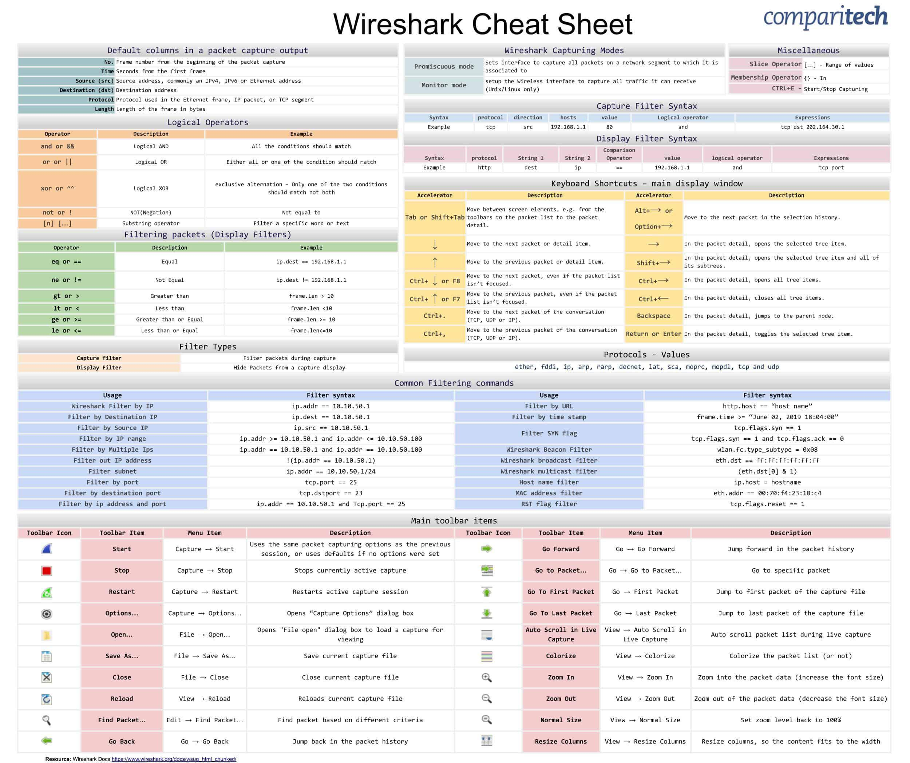

import { Tab, Tabs } from 'fumadocs-ui/components/tabs';
import { Step, Steps } from 'fumadocs-ui/components/steps';
import { Accordion, Accordions } from 'fumadocs-ui/components/accordion';

<div style={{ width: '60%', height: 'auto', margin: '0 auto' }}>
  
</div>

# TShark Query Filters Cheatsheet

<Callout title="TShark" type="info">
  TShark is a powerful network protocol analyzer that allows you to capture packet data from live networks or read packets from previously saved capture files. It's the command-line version of Wireshark, providing all the power of Wireshark's filtering capabilities in a terminal interface.
</Callout>

## 1. Basic Usage

<Tabs items={["Capture", "Read", "Display Filters", "Basic Commands"]}>
  <Tab>
    <div className="p-4 border rounded-lg bg-white dark:bg-gray-800 my-4">
      <h4 className="font-bold mb-2 text-blue-600 dark:text-blue-400">Capture Commands</h4>
      
      <h5 className="font-semibold mt-4 mb-2">Interface Selection</h5>
      ```bash
      tshark -D                    # List available interfaces
      tshark -i eth0              # Capture on specific interface
      tshark -i 2                 # Capture on interface number 2
      ```

      <h5 className="font-semibold mt-4 mb-2">Capture Options</h5>
      ```bash
      tshark -i eth0 -w file.pcap  # Save capture to file
      tshark -i eth0 -c 100        # Capture 100 packets
      tshark -i eth0 -a duration:30 # Capture for 30 seconds
      tshark -i eth0 -f "port 80"  # Capture with filter
      ```
    </div>
  </Tab>
  <Tab>
    <div className="p-4 border rounded-lg bg-white dark:bg-gray-800 my-4">
      <h4 className="font-bold mb-2 text-green-600 dark:text-green-400">Reading Captures</h4>
      
      <h5 className="font-semibold mt-4 mb-2">Basic Reading</h5>
      ```bash
      tshark -r file.pcap         # Read capture file
      tshark -nr file.pcap        # Read without name resolution
      tshark -r file.pcap -V      # Read with packet details
      ```

      <h5 className="font-semibold mt-4 mb-2">Output Options</h5>
      ```bash
      tshark -r file.pcap -T fields    # Output specific fields
      tshark -r file.pcap -T pdml      # Output in PDML format
      tshark -r file.pcap -T json      # Output in JSON format
      ```
    </div>
  </Tab>
  <Tab>
    <div className="p-4 border rounded-lg bg-white dark:bg-gray-800 my-4">
      <h4 className="font-bold mb-2 text-purple-600 dark:text-purple-400">Display Filters</h4>
      
      <h5 className="font-semibold mt-4 mb-2">Protocol Filters</h5>
      ```bash
      tshark -Y "http"            # Show HTTP packets
      tshark -Y "dns"             # Show DNS packets
      tshark -Y "tcp"             # Show TCP packets
      ```

      <h5 className="font-semibold mt-4 mb-2">Logical Operators</h5>
      ```bash
      tshark -Y "http && ip.src==10.0.0.1"
      tshark -Y "tcp || udp"
      tshark -Y "!icmp"
      ```
    </div>
  </Tab>
  <Tab>
    <div className="p-4 border rounded-lg bg-white dark:bg-gray-800 my-4">
      <h4 className="font-bold mb-2 text-red-600 dark:text-red-400">Basic Commands</h4>
      
      <h5 className="font-semibold mt-4 mb-2">Statistics</h5>
      ```bash
      tshark -r file.pcap -q -z io,phs
      tshark -r file.pcap -q -z conv,tcp
      tshark -r file.pcap -q -z http,tree
      ```

      <h5 className="font-semibold mt-4 mb-2">Common Options</h5>
      ```bash
      tshark -v                   # Show version
      tshark -h                   # Show help
      tshark -G fields           # List available fields
      ```
    </div>
  </Tab>
</Tabs>

## 2. Advanced Filters

<Tabs items={["HTTP/HTTPS", "DNS", "TCP/IP", "Advanced Features"]}>
  <Tab>
    <div className="p-4 border rounded-lg bg-white dark:bg-gray-800 my-4">
      <h4 className="font-bold mb-2 text-blue-600 dark:text-blue-400">HTTP/HTTPS Filters</h4>
      
      <h5 className="font-semibold mt-4 mb-2">HTTP Methods</h5>
      ```bash
      http.request.method == "GET"
      http.request.method == "POST"
      http.response.code == 200
      ```

      <h5 className="font-semibold mt-4 mb-2">HTTPS/SSL</h5>
      ```bash
      ssl.handshake.type == 1     # Client Hello
      ssl.handshake.type == 11    # Certificate
      ssl.handshake.ciphersuite   # Cipher suites
      ```
    </div>
  </Tab>
  <Tab>
    <div className="p-4 border rounded-lg bg-white dark:bg-gray-800 my-4">
      <h4 className="font-bold mb-2 text-green-600 dark:text-green-400">DNS Filters</h4>
      
      <h5 className="font-semibold mt-4 mb-2">Query Types</h5>
      ```bash
      dns.qry.type == 1           # A Record
      dns.qry.type == 28          # AAAA Record
      dns.qry.type == 5           # CNAME Record
      ```

      <h5 className="font-semibold mt-4 mb-2">DNS Analysis</h5>
      ```bash
      dns.flags.response == 0      # DNS Queries
      dns.flags.response == 1      # DNS Responses
      dns.qry.name contains "example.com"
      ```
    </div>
  </Tab>
  <Tab>
    <div className="p-4 border rounded-lg bg-white dark:bg-gray-800 my-4">
      <h4 className="font-bold mb-2 text-purple-600 dark:text-purple-400">TCP/IP Filters</h4>
      
      <h5 className="font-semibold mt-4 mb-2">IP Filters</h5>
      ```bash
      ip.addr == 192.168.1.1
      ip.src == 10.0.0.1
      ip.dst == 8.8.8.8
      ```

      <h5 className="font-semibold mt-4 mb-2">TCP Flags</h5>
      ```bash
      tcp.flags.syn == 1
      tcp.flags.ack == 1
      tcp.flags.reset == 1
      ```
    </div>
  </Tab>
  <Tab>
    <div className="p-4 border rounded-lg bg-white dark:bg-gray-800 my-4">
      <h4 className="font-bold mb-2 text-red-600 dark:text-red-400">Advanced Features</h4>
      
      <h5 className="font-semibold mt-4 mb-2">Field Extraction</h5>
      ```bash
      -e frame.time
      -e ip.src
      -e http.host
      -e dns.qry.name
      ```

      <h5 className="font-semibold mt-4 mb-2">Export Objects</h5>
      ```bash
      --export-objects http,/path
      --export-objects smb,/path
      --export-objects imf,/path
      ```
    </div>
  </Tab>
</Tabs>

## 3. Common Use Cases

<Accordions>
  <Accordion title="Network Troubleshooting">
    ```bash
    # Capture TCP retransmissions
    tshark -i eth0 -Y "tcp.analysis.retransmission"

    # Find packet loss
    tshark -i eth0 -Y "tcp.analysis.lost_segment"

    # Monitor network latency
    tshark -i eth0 -n -q -z io,stat,1,"COUNT(tcp.analysis.ack_rtt)tcp.analysis.ack_rtt"
    ```
  </Accordion>

  <Accordion title="Security Analysis">
    ```bash
    # Detect port scanning
    tshark -i eth0 -Y "tcp.flags.syn==1 && tcp.flags.ack==0"

    # Monitor for suspicious DNS queries
    tshark -i eth0 -Y "dns.qry.name contains 'suspicious'"

    # Find potential data exfiltration
    tshark -i eth0 -Y "http.request.method==POST && http.file_data"
    ```
  </Accordion>

  <Accordion title="Performance Monitoring">
    ```bash
    # Monitor HTTP response times
    tshark -i eth0 -Y "http.response.code==200" -T fields -e http.time

    # Analyze TCP window sizes
    tshark -i eth0 -T fields -e tcp.window_size

    # Check for network congestion
    tshark -i eth0 -Y "tcp.analysis.window_full"
    ```
  </Accordion>
</Accordions>



## 4. Tips and Best Practices

<Steps>
  <Step title="Capture Optimization">
    - Use capture filters (`-f`) to reduce capture size
    - Save to file (`-w`) for later analysis
    - Use ring buffer (`-b`) for long captures
  </Step>

  <Step title="Analysis Efficiency">
    - Use display filters (`-Y`) for precise analysis
    - Extract specific fields with `-T fields -e`
    - Leverage statistics (`-z`) for quick insights
  </Step>

  <Step title="Performance">
    - Disable name resolution (`-n`) for faster processing
    - Use appropriate buffer sizes (`-B`)
    - Consider using dumpcap for pure capture
  </Step>
</Steps>

## Sources

1. [Official TShark Documentation](https://www.wireshark.org/docs/man-pages/tshark.html)
2. [Wireshark User's Guide](https://www.wireshark.org/docs/)
3. [SANS Network Forensics](https://www.sans.org/digital-forensics-incident-response/)
4. [Packetlife Cheat Sheets](https://packetlife.net/library/cheat-sheets/)
5. [TCP/IP Guide](http://www.tcpipguide.com/)
6. [TShark Command Line Examples](https://gist.github.com/githubfoam/6c9e07f95c2eb03ec4ae9709252c713f)
7. [TShark Wireshark Command Line Cheat Sheet](https://cheatography.com/mbwalker/cheat-sheets/tshark-wireshark-command-line/)
8. [HackerTarget TShark Tutorial](https://hackertarget.com/tshark-tutorial-and-filter-examples/)
9. [Reddit Cybersecurity Wireshark Guide](https://www.reddit.com/r/cybersecurity/comments/hgntb2/wireshark_cheat_sheet/)
10. [SANS Blue Team Wiki - TShark](https://wiki.sans.blue/#!Tools/tshark.md)
11. [StationX Wireshark Cheat Sheet](https://www.stationx.net/wireshark-cheat-sheet/)
12. [Exploit Notes Wireshark Guide](https://exploit-notes.hdks.org/exploit/network/tool/wireshark-cheat-sheet/)