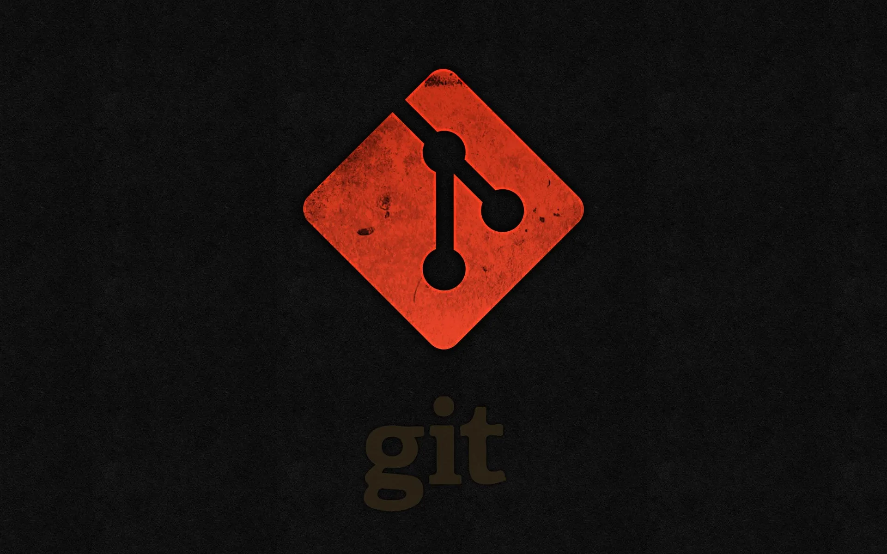

import { Tab, Tabs } from 'fumadocs-ui/components/tabs';
import { Step, Steps } from 'fumadocs-ui/components/steps';
import { Accordion, Accordions } from 'fumadocs-ui/components/accordion';
import { Files, Folder, File } from 'fumadocs-ui/components/files';

## Setup

<Tabs items={["Configuration", "Repository Setup"]}>
  <Tab>
    <Steps>
      <Step>
        <h4>Set username and email</h4>
        ```bash
        git config --global user.name "Your Name"
        git config --global user.email "your.email@example.com"
        ```
      </Step>
      <Step>
        <h4>Set default editor</h4>
        ```bash
        git config --global core.editor "code --wait"
        ```
      </Step>
      <Step>
        <h4>View configuration</h4>
        ```bash
        git config --list
        ```
      </Step>
    </Steps>
  </Tab>
  <Tab>
    <Steps>
      <Step>
        <h4>Initialize repository</h4>
        ```bash
        git init
        ```
      </Step>
      <Step>
        <h4>Clone repository</h4>
        ```bash
        git clone https://github.com/username/repository.git
        ```
      </Step>
      <Step>
        <h4>Clone specific branch</h4>
        ```bash
        git clone -b branch-name https://github.com/username/repository.git
        ```
      </Step>
    </Steps>
  </Tab>
</Tabs>

## Basic Commands

<Callout title="Control de versiones" type="info">
  Git tracks changes to your files and allows you to save snapshots of your project over time.
</Callout>

<Steps>
  <Step>
    <h4>Check status</h4>
    ```bash
    git status
    ```
  </Step>
  <Step>
    <h4>Stage changes</h4>
    ```bash
    git add file.txt        # Add specific file
    git add .               # Add all changes
    git add -p              # Add changes interactively
    ```
  </Step>
  <Step>
    <h4>Commit changes</h4>
    ```bash
    git commit -m "Commit message"
    git commit -am "Add and commit with message"
    ```
  </Step>
</Steps>

<Card className="p-6 bg-gradient-to-br from-slate-50 to-slate-100 dark:from-slate-900 dark:to-slate-800 border border-slate-200 dark:border-slate-700 rounded-lg shadow-sm">
  <h3 className="text-lg font-semibold text-slate-800 dark:text-slate-200 mb-3">Archivos de Configuración Git</h3>
  <div className="space-y-2">
    <div className="flex items-start">
      <div className="bg-blue-100 dark:bg-blue-900 p-2 rounded-md mr-3">
        <code className="text-xs text-blue-800 dark:text-blue-200">~/.gitconfig</code>
      </div>
      <p className="text-sm text-slate-600 dark:text-slate-300">Configuración global del usuario</p>
    </div>
    <div className="flex items-start">
      <div className="bg-green-100 dark:bg-green-900 p-2 rounded-md mr-3">
        <code className="text-xs text-green-800 dark:text-green-200">.git/config</code>
      </div>
      <p className="text-sm text-slate-600 dark:text-slate-300">Configuración específica del repositorio</p>
    </div>
    <div className="flex items-start">
      <div className="bg-amber-100 dark:bg-amber-900 p-2 rounded-md mr-3">
        <code className="text-xs text-amber-800 dark:text-amber-200">.gitignore</code>
      </div>
      <p className="text-sm text-slate-600 dark:text-slate-300">Archivos a ignorar</p>
    </div>
    <div className="flex items-start">
      <div className="bg-purple-100 dark:bg-purple-900 p-2 rounded-md mr-3">
        <code className="text-xs text-purple-800 dark:text-purple-200">.git/hooks/</code>
      </div>
      <p className="text-sm text-slate-600 dark:text-slate-300">Directorio de hooks de Git</p>
    </div>
  </div>
</Card>
<br/>

# 🌿 Branching and Merging

<Tabs items={["Branch Management", "Merging"]}>
  <Tab>
    <Card>
      <h4>List branches</h4>
      ```bash
      git branch            # Local branches
      git branch -r         # Remote branches
      git branch -a         # All branches
      ```
      
      <h4>Create branch</h4>
      ```bash
      git branch branch-name
      git checkout -b branch-name
      ```
      
      <h4>Switch branch</h4>
      ```bash
      git checkout branch-name
      git switch branch-name
      ```
      
      <h4>Delete branch</h4>
      ```bash
      git branch -d branch-name     # Safe delete
      git branch -D branch-name     # Force delete
      ```
    </Card>
  </Tab>
  <Tab>
    <Card>      
      <h4>Merge branch</h4>
      ```bash
      git merge branch-name
      ```
      <h4>Merge with no fast-forward</h4>
      ```bash
      git merge --no-ff branch-name
      ```
      <h4>Abort merge</h4>
      ```bash
      git merge --abort
      ```
      <h4>Resolve conflicts</h4>
      ```bash
      # Edit conflicted files, then:
      git add <resolved-file>
      git commit
      ```
    </Card>
  </Tab>
</Tabs>

## Stashing

<Steps>
  <Step>
    <h4>Save changes temporarily</h4>
    ```bash
    git stash
    git stash save "stash message"
    ```
  </Step>
  <Step>
    <h4>List stashes</h4>
    ```bash
    git stash list
    ```
  </Step>
  <Step>
    <h4>Apply stash</h4>
    ```bash
    git stash apply          # Apply most recent stash
    git stash apply stash@{2}  # Apply specific stash
    git stash pop            # Apply and remove stash
    ```
  </Step>
  <Step>
    <h4>Delete stash</h4>
    ```bash
    git stash drop stash@{0}
    git stash clear          # Remove all stashes
    ```
  </Step>
</Steps>

# 🔄 Remote Operations

<Tabs items={["Remote Management", "Syncing"]}>
  <Tab>
    <Card>
      <h4>List remotes</h4>
      ```bash
      git remote -v
      ```
      
      <h4>Add remote</h4>
      ```bash
      git remote add origin https://github.com/username/repo.git
      ```
      
      <h4>Change remote URL</h4>
      ```bash
      git remote set-url origin https://github.com/username/repo.git
      ```
      
      <h4>Remove remote</h4>
      ```bash
      git remote remove origin
      ```
    </Card>
  </Tab>
  <Tab>
    <Card>      
      <h4>Fetch changes</h4>
      ```bash
      git fetch
      git fetch origin
      ```
      <h4>Pull changes</h4>
      ```bash
      git pull
      git pull origin main
      git pull --rebase origin main
      ```
      <h4>Push changes</h4>
      ```bash
      git push
      git push -u origin branch-name
      git push --force-with-lease origin branch-name
      ```
    </Card>
  </Tab>
</Tabs>

# 📜 History and Logs

<Callout title="Visualización de historial" type="tip">
  ```bash
  git log --oneline --graph --decorate --all
  # Shows a compact, graphical representation of commit history
  ```
</Callout>

<Tabs items={["Viewing History", "Advanced Log"]}>
  <Tab>
    <Steps>
      <Step>
        <h4>View commit history</h4>
        ```bash
        git log
        git log --oneline
        ```
      </Step>
      <Step>
        <h4>View changes in commit</h4>
        ```bash
        git show commit-hash
        ```
      </Step>
      <Step>
        <h4>View file history</h4>
        ```bash
        git log -p filename
        ```
      </Step>
    </Steps>
  </Tab>
  <Tab>
    <Steps>
      <Step>
        <h4>Graph visualization</h4>
        ```bash
        git log --graph --oneline --all
        ```
      </Step>
      <Step>
        <h4>Filter by author</h4>
        ```bash
        git log --author="username"
        ```
      </Step>
      <Step>
        <h4>Filter by date</h4>
        ```bash
        git log --since="2 weeks ago"
        ```
      </Step>
    </Steps>
  </Tab>
</Tabs>

# 🔧 Advanced Operations

<Tabs items={["Rewriting History", "Troubleshooting"]}>
  <Tab>
    <Card>
      <h4>Amend last commit</h4>
      ```bash
      git commit --amend
      git commit --amend --no-edit
      ```
      
      <h4>Interactive rebase</h4>
      ```bash
      git rebase -i HEAD~3
      ```
      
      <h4>Cherry-pick commits</h4>
      ```bash
      git cherry-pick commit-hash
      ```
      
      <h4>Reset to commit</h4>
      ```bash
      git reset --soft HEAD~1   # Keep changes staged
      git reset --mixed HEAD~1  # Keep changes unstaged
      git reset --hard HEAD~1   # Discard changes
      ```
    </Card>
  </Tab>
  <Tab>
    <Card>      
      <h4>Check for corruption</h4>
      ```bash
      git fsck
      ```
      <h4>Clean untracked files</h4>
      ```bash
      git clean -n  # Dry run
      git clean -fd # Force delete files and directories
      ```
      <h4>Recover lost commits</h4>
      ```bash
      git reflog
      git checkout commit-hash
      ```
      <h4>Bisect to find bugs</h4>
      ```bash
      git bisect start
      git bisect bad
      git bisect good commit-hash
      # After finding the issue:
      git bisect reset
      ```
    </Card>
  </Tab>
</Tabs>

# 🌐 GitHub Workflow

<Tabs items={["Pull Requests", "Collaboration"]}>
  <Tab>
    <Steps>
      <Step>
        <h4>Fork repository</h4>
        ```bash
        # Click Fork button on GitHub
        ```
      </Step>
      <Step>
        <h4>Clone your fork</h4>
        ```bash
        git clone https://github.com/your-username/repo.git
        ```      </Step>
      <Step>
        <h4>Add upstream remote</h4>
        ```bash
        git remote add upstream https://github.com/original-owner/repo.git
        ```
      </Step>
      <Step>
        <h4>Create feature branch</h4>
        ```bash
        git checkout -b feature-branch
        ```
      </Step>
      <Step>
        <h4>Push and create PR</h4>
        ```bash
        git push -u origin feature-branch
        # Then create PR on GitHub
        ```
      </Step>
    </Steps>
  </Tab>
  <Tab>
    <Steps>
      <Step>
        <h4>Sync fork with upstream</h4>
        ```bash
        git fetch upstream
        git checkout main
        git merge upstream/main
        git push origin main
        ```
      </Step>
      <Step>
        <h4>Update PR branch</h4>
        ```bash
        git checkout feature-branch
        git rebase main
        git push --force-with-lease origin feature-branch
        ```
      </Step>
    </Steps>
  </Tab>
</Tabs>

<Card className="p-6 bg-gradient-to-br from-indigo-50 to-blue-100 dark:from-indigo-900 dark:to-blue-800 border border-indigo-200 dark:border-indigo-700 rounded-lg shadow-md">
  <h3 className="text-xl font-bold text-indigo-800 dark:text-indigo-200 mb-4">Comandos de GitHub CLI</h3>
  <div className="space-y-3">
    <div className="flex items-center bg-white dark:bg-slate-800 p-3 rounded-md shadow-sm">
      <code className="text-sm text-indigo-600 dark:text-indigo-300 font-mono">gh repo create</code>
      <span className="ml-4 text-sm text-slate-600 dark:text-slate-300">Crear nuevo repositorio</span>
    </div>
    <div className="flex items-center bg-white dark:bg-slate-800 p-3 rounded-md shadow-sm">
      <code className="text-sm text-indigo-600 dark:text-indigo-300 font-mono">gh pr create</code>
      <span className="ml-4 text-sm text-slate-600 dark:text-slate-300">Crear pull request</span>
    </div>
    <div className="flex items-center bg-white dark:bg-slate-800 p-3 rounded-md shadow-sm">
      <code className="text-sm text-indigo-600 dark:text-indigo-300 font-mono">gh pr checkout NUMBER</code>
      <span className="ml-4 text-sm text-slate-600 dark:text-slate-300">Revisar un pull request</span>
    </div>
    <div className="flex items-center bg-white dark:bg-slate-800 p-3 rounded-md shadow-sm">
      <code className="text-sm text-indigo-600 dark:text-indigo-300 font-mono">gh issue create</code>
      <span className="ml-4 text-sm text-slate-600 dark:text-slate-300">Crear issue</span>
    </div>
    <div className="flex items-center bg-white dark:bg-slate-800 p-3 rounded-md shadow-sm">
      <code className="text-sm text-indigo-600 dark:text-indigo-300 font-mono">gh issue list</code>
      <span className="ml-4 text-sm text-slate-600 dark:text-slate-300">Listar issues</span>
    </div>
    <div className="flex items-center bg-white dark:bg-slate-800 p-3 rounded-md shadow-sm">
      <code className="text-sm text-indigo-600 dark:text-indigo-300 font-mono">gh release create TAG</code>
      <span className="ml-4 text-sm text-slate-600 dark:text-slate-300">Crear release</span>
    </div>
  </div>
</Card>
<br/>

# ⚡ Git Aliases and Shortcuts

<Callout title="Alias y atajos" type="info">
  Git aliases allow you to create shortcuts for frequently used commands, making your workflow more efficient.
</Callout>

<Tabs items={["Basic Aliases", "Advanced Aliases", "Custom Scripts"]}>
  <Tab>
    <Steps>
      <Step>
        <h4>Setting up basic aliases</h4>
        ```bash
        git config --global alias.co checkout
        git config --global alias.br branch
        git config --global alias.ci commit
        git config --global alias.st status
        ```
      </Step>
      <Step>
        <h4>Using aliases</h4>
        ```bash
        git co main       # Instead of git checkout main
        git br            # Instead of git branch
        git ci -m "Fix"   # Instead of git commit -m "Fix"
        git st            # Instead of git status
        ```
      </Step>
    </Steps>
  </Tab>
  <Tab>
    <Card>
      <h4>Log formatting aliases</h4>
      ```bash
      git config --global alias.lg "log --graph --pretty=format:'%Cred%h%Creset -%C(yellow)%d%Creset %s %Cgreen(%cr) %C(bold blue)<%an>%Creset' --abbrev-commit"
      git config --global alias.ll "log --pretty=format:'%C(yellow)%h%Cred%d %Creset%s%Cblue [%cn]' --decorate --numstat"
      ```
      
      <h4>Workflow aliases</h4>
      ```bash
      git config --global alias.unstage "reset HEAD --"
      git config --global alias.last "log -1 HEAD"
      git config --global alias.visual "!gitk"
      ```
    </Card>
  </Tab>
  <Tab>
    <Card>
      <h4>Creating function-like aliases</h4>
      ```bash
      git config --global alias.find '!git ls-files | grep -i'
      git config --global alias.cleanup '!git branch --merged | grep -v "\*" | xargs -n 1 git branch -d'
      ```
      
      <h4>Adding to .gitconfig file</h4>
      ```ini
      [alias]
        # Show all aliases
        aliases = !git config --get-regexp alias | sed 's/alias\\.\\([^ ]*\\) \\(.*\\)/\\1\\\t => \\2/' | sort
        
        # Amend the currently staged files to the latest commit
        amend = commit --amend --reuse-message=HEAD
        
        # Interactive rebase with the given number of latest commits
        reb = "!r() { git rebase -i HEAD~$1; }; r"
      ```
    </Card>
  </Tab>
</Tabs>

<Accordions>
  <Accordion title="Common Alias Examples">
    ```bash
    # Shortcuts
    git config --global alias.cp cherry-pick
    git config --global alias.d diff
    git config --global alias.dc "diff --cached"
    git config --global alias.p push
    git config --global alias.pl pull
    
    # Complex commands made simple
    git config --global alias.undo "reset --soft HEAD^"
    git config --global alias.stash-all "stash save --include-untracked"
    git config --global alias.glog "log --all --graph --decorate --oneline"
    ```
  </Accordion>
  <Accordion title="Shell Integration">
    <p>You can also create bash/zsh aliases for git commands:</p>
    ```bash
    # Add to .bashrc or .zshrc
    alias g='git'
    alias gco='git checkout'
    alias gaa='git add --all'
    alias gcm='git commit -m'
    alias gp='git push'
    alias gpl='git pull'
    alias gst='git status'
    ```
  </Accordion>
</Accordions>
<br/>
<Card className="p-6 bg-gradient-to-br from-indigo-50 to-purple-100 dark:from-indigo-900 dark:to-purple-800 border border-indigo-200 dark:border-indigo-700 rounded-lg shadow-md">
  <h3 className="text-lg font-semibold text-indigo-800 dark:text-indigo-200 mb-3">Productivity Tips</h3>
  <div className="space-y-2">
    <div className="flex items-start">
      <div className="bg-blue-200 dark:bg-blue-800 p-2 rounded-md mr-3">
        <code className="text-xs text-blue-800 dark:text-blue-200">git config --global alias.save</code>
      </div>
      <p className="text-sm text-slate-600 dark:text-slate-300">Create a "save" alias that combines add and commit in a single command</p>
    </div>
    <div className="flex items-start">
      <div className="bg-purple-200 dark:bg-purple-800 p-2 rounded-md mr-3">
        <code className="text-xs text-purple-800 dark:text-purple-200">git config --global --edit</code>
      </div>
      <p className="text-sm text-slate-600 dark:text-slate-300">Edit your global git config file to add multiple aliases at once</p>
    </div>
    <div className="flex items-start">
      <div className="bg-indigo-200 dark:bg-indigo-800 p-2 rounded-md mr-3">
        <code className="text-xs text-indigo-800 dark:text-indigo-200">git aliases</code>
      </div>
      <p className="text-sm text-slate-600 dark:text-slate-300">Create an "aliases" alias to list all your configured aliases</p>
    </div>
  </div>
</Card>


