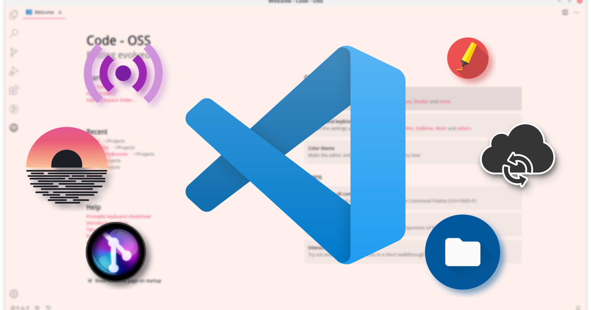

import { Tab, Tabs } from 'fumadocs-ui/components/tabs';
import { Step, Steps } from 'fumadocs-ui/components/steps';
import { Accordion, Accordions } from 'fumadocs-ui/components/accordion';
import { Files, Folder, File } from 'fumadocs-ui/components/files';
import { Callout } from 'fumadocs-ui/components/callout';

## Installation

<Tabs items={["Windows", "macOS", "Linux"]}>
  <Tab>
    <Steps>
      <Step>
        <h4>Download the installer</h4>
        ```bash
        # Visit https://code.visualstudio.com/download
        ```
      </Step>
      <Step>
        <h4>Run the installer</h4>
        <p>Follow the installation wizard instructions</p>
      </Step>
      <Step>
        <h4>Verify installation</h4>
        ```bash
        code --version
        ```
      </Step>
    </Steps>
  </Tab>
  <Tab>
    <Steps>
      <Step>
        <h4>Download the installer</h4>
        ```bash
        # Visit https://code.visualstudio.com/download
        ```
      </Step>
      <Step>
        <h4>Install with Homebrew</h4>
        ```bash
        brew install --cask visual-studio-code
        ```
      </Step>
      <Step>
        <h4>Verify installation</h4>
        ```bash
        code --version
        ```
      </Step>
    </Steps>
  </Tab>
  <Tab>
    <Steps>
      <Step>
        <h4>Install via repository</h4>
        ```bash
        # For Debian/Ubuntu based distributions
        sudo apt update
        sudo apt install software-properties-common apt-transport-https wget
        wget -q https://packages.microsoft.com/keys/microsoft.asc -O- | sudo apt-key add -
        sudo add-apt-repository "deb [arch=amd64] https://packages.microsoft.com/repos/vscode stable main"
        sudo apt update
        sudo apt install code
        ```
      </Step>
      <Step>
        <h4>Verify installation</h4>
        ```bash
        code --version
        ```
      </Step>
    </Steps>
  </Tab>
</Tabs>

## Basic Commands

<Callout type="info">
  Visual Studio Code is a lightweight but powerful source code editor that runs on your desktop and is available for Windows, macOS, and Linux.
</Callout>

<Steps>
  <Step>
    <h4>Open VS Code</h4>
    ```bash
    code                    # Open VS Code
    code .                  # Open current folder
    code file.txt           # Open specific file
    code -n                 # Open new window
    ```
  </Step>
  <Step>
    <h4>Open command palette</h4>
    ```bash
    Ctrl+Shift+P (Windows/Linux)
    Cmd+Shift+P (macOS)
    ```
  </Step>
  <Step>
    <h4>Open settings</h4>
    ```bash
    Ctrl+, (Windows/Linux)
    Cmd+, (macOS)
    ```
  </Step>
</Steps>

<Card className="border-2 border-blue-100 dark:border-blue-900 rounded-lg p-4 shadow-md">
  <h3 className="text-xl font-bold mb-3 text-blue-600 dark:text-blue-400">Important Configuration Files</h3>
  <div className="grid grid-cols-1 md:grid-cols-3 gap-3">
    <div className="bg-gray-50 dark:bg-gray-800 p-3 rounded-md">
      <code className="text-sm font-mono">settings.json</code>
      <p className="text-xs mt-1 text-gray-600 dark:text-gray-400">User settings</p>
    </div>
    <div className="bg-gray-50 dark:bg-gray-800 p-3 rounded-md">
      <code className="text-sm font-mono">keybindings.json</code>
      <p className="text-xs mt-1 text-gray-600 dark:text-gray-400">Custom keyboard shortcuts</p>
    </div>
    <div className="bg-gray-50 dark:bg-gray-800 p-3 rounded-md">
      <code className="text-sm font-mono">launch.json</code>
      <p className="text-xs mt-1 text-gray-600 dark:text-gray-400">Debugging configuration</p>
    </div>
  </div>
</Card>

<br/>

# ⌨️ Essential Keyboard Shortcuts

<Tabs items={["Editing", "Navigation", "Search", "Interface"]}>
  <Tab>
    <Card>
      <h4>Basic editing</h4>
      ```bash
      Ctrl+X                # Cut line (empty selection)
      Ctrl+C                # Copy line (empty selection)
      Alt+↑/↓               # Move line up/down
      Shift+Alt+↑/↓         # Copy line up/down
      Ctrl+Shift+K          # Delete line
      Ctrl+Enter            # Insert line below
      Ctrl+Shift+Enter      # Insert line above
      ```
      
      <h4>Multi-cursor selection</h4>
      ```bash
      Alt+Click             # Insert cursor
      Ctrl+Alt+↑/↓          # Insert cursor above/below
      Ctrl+D                # Select next occurrence
      Ctrl+Shift+L          # Select all occurrences
      ```
      
      <h4>Formatting</h4>
      ```bash
      Shift+Alt+F           # Format document
      Ctrl+K Ctrl+F         # Format selection
      ```
    </Card>
  </Tab>
  <Tab>
    <Card>      
      <h4>File navigation</h4>
      ```bash
      Ctrl+G                # Go to line
      Ctrl+P                # Go to file
      Ctrl+Shift+O          # Go to symbol
      Ctrl+Tab              # Navigate between open files
      ```
      <h4>Code navigation</h4>
      ```bash
      F12                   # Go to definition
      Alt+F12               # Peek definition
      Ctrl+Shift+\          # Go to matching bracket
      Ctrl+Home/End         # Go to beginning/end of file
      ```
      <h4>Editor navigation</h4>
      ```bash
      Ctrl+1/2/3            # Focus on editor group 1/2/3
      Ctrl+K Ctrl+←/→       # Move editor to left/right group
      Ctrl+W                # Close editor
      ```
    </Card>
  </Tab>
  <Tab>
    <Card>      
      <h4>Basic search</h4>
      ```bash
      Ctrl+F                # Find
      Ctrl+H                # Replace
      F3 / Shift+F3         # Find next/previous
      ```
      <h4>Advanced search</h4>
      ```bash
      Ctrl+Shift+F          # Find in files
      Ctrl+Shift+H          # Replace in files
      ```
      <h4>Intelligent search</h4>
      ```bash
      Ctrl+Space            # Trigger suggestions
      Ctrl+Shift+Space      # Parameter hints
      Ctrl+I                # Suggest line completion
      ```
    </Card>
  </Tab>
  <Tab>
    <Card>      
      <h4>Panels and views</h4>
      ```bash
      Ctrl+B                # Toggle sidebar
      Ctrl+Shift+E          # Explorer
      Ctrl+Shift+F          # Search
      Ctrl+Shift+G          # Source control
      Ctrl+Shift+D          # Debug
      Ctrl+Shift+X          # Extensions
      ```
      <h4>Display</h4>
      ```bash
      F11                   # Toggle full screen
      Ctrl+= / Ctrl+-       # Zoom in/out
      Ctrl+Shift+V          # Markdown preview
      ```
      <h4>Terminal</h4>
      ```bash
      Ctrl+`                # Toggle integrated terminal
      Ctrl+Shift+`          # Create new terminal
      ```
    </Card>
  </Tab>
</Tabs>

## Window Management

<Steps>
  <Step>
    <h4>Split editor</h4>
    ```bash
    Ctrl+\                  # Split editor
    Ctrl+K Ctrl+\           # Split editor orthogonally
    ```
  </Step>
  <Step>
    <h4>Editor groups</h4>
    ```bash
    Ctrl+1/2/3              # Switch to editor group 1/2/3
    Ctrl+K Ctrl+←/→         # Move editor to left/right group
    ```
  </Step>
  <Step>
    <h4>Zoom and focus</h4>
    ```bash
    Ctrl+= / Ctrl+-         # Zoom in/out
    Ctrl+K Z                # Zen mode (distraction-free)
    ```
  </Step>
</Steps>

<Card className="p-6 bg-gradient-to-br from-slate-50 to-slate-100 dark:from-slate-900 dark:to-slate-800 border border-slate-200 dark:border-slate-700 rounded-lg shadow-sm">
  <h3 className="text-lg font-semibold text-slate-800 dark:text-slate-200 mb-3">Developer Shortcuts</h3>
  <div className="space-y-2">
    <div className="flex items-start">
      <div className="bg-blue-100 dark:bg-blue-900 p-2 rounded-md mr-3">
        <code className="text-xs text-blue-800 dark:text-blue-200">F5</code>
      </div>
      <p className="text-sm text-slate-600 dark:text-slate-300">Start debugging</p>
    </div>
    <div className="flex items-start">
      <div className="bg-green-100 dark:bg-green-900 p-2 rounded-md mr-3">
        <code className="text-xs text-green-800 dark:text-green-200">Ctrl+Shift+B</code>
      </div>
      <p className="text-sm text-slate-600 dark:text-slate-300">Run build task</p>
    </div>
    <div className="flex items-start">
      <div className="bg-amber-100 dark:bg-amber-900 p-2 rounded-md mr-3">
        <code className="text-xs text-amber-800 dark:text-amber-200">F9</code>
      </div>
      <p className="text-sm text-slate-600 dark:text-slate-300">Toggle breakpoint</p>
    </div>
    <div className="flex items-start">
      <div className="bg-purple-100 dark:bg-purple-900 p-2 rounded-md mr-3">
        <code className="text-xs text-purple-800 dark:text-purple-200">Ctrl+K Ctrl+T</code>
      </div>
      <p className="text-sm text-slate-600 dark:text-slate-300">Change color theme</p>
    </div>
  </div>
</Card>
<br/>

# 🧩 Extensions

<Tabs items={["Management", "Recommended"]}>
  <Tab>
    <Card>
      <h4>Install extensions</h4>
      ```bash
      # From the interface
      Ctrl+Shift+X          # Open extensions panel
      
      # From the command line
      code --install-extension ms-python.python
      ```
      
      <h4>Update extensions</h4>
      ```bash
      # From the interface: Extensions panel → Update
      
      # From the command line
      code --list-extensions --show-versions
      ```
      
      <h4>Disable/Uninstall extensions</h4>
      ```bash
      # From the interface: Extensions panel → Disable/Uninstall
      
      # Uninstall from command line
      code --uninstall-extension ms-python.python
      ```
    </Card>
  </Tab>
  <Tab>
    <Card>      
      <h4>General development</h4>
      ```bash
      # Prettier - Code formatter
      code --install-extension esbenp.prettier-vscode
      
      # GitLens - Supercharge Git
      code --install-extension eamodio.gitlens
      
      # Live Share - Real-time collaboration
      code --install-extension ms-vsliveshare.vsliveshare
      ```
      <h4>Language specific</h4>
      ```bash
      # Python
      code --install-extension ms-python.python
      
      # JavaScript/TypeScript
      code --install-extension dbaeumer.vscode-eslint
      
      # C/C++
      code --install-extension ms-vscode.cpptools
      
      # Java
      code --install-extension redhat.java
      ```
      <h4>Themes and UI</h4>
      ```bash
      # Material Icon Theme
      code --install-extension pkief.material-icon-theme
      
      # One Dark Pro
      code --install-extension zhuangtongfa.material-theme
      
      # Bracket Pair Colorizer 2
      code --install-extension coenraads.bracket-pair-colorizer-2
      ```
    </Card>
  </Tab>
</Tabs>

# ⚙️ Customization

<Tabs items={["Settings", "Themes", "Snippets"]}>
  <Tab>
    <Steps>
      <Step>
        <h4>Open settings</h4>
        ```bash
        Ctrl+, (Windows/Linux)
        Cmd+, (macOS)
        ```
      </Step>
      <Step>
        <h4>Edit settings.json</h4>
        ```bash
        # From command palette (Ctrl+Shift+P):
        > Preferences: Open Settings (JSON)
        ```
      </Step>
      <Step>
        <h4>Common settings</h4>
        ```json
        {
          "editor.fontSize": 14,
          "editor.fontFamily": "Fira Code, Consolas, monospace",
          "editor.tabSize": 2,
          "editor.wordWrap": "on",
          "editor.formatOnSave": true,
          "editor.minimap.enabled": false,
          "workbench.startupEditor": "newUntitledFile",
          "files.autoSave": "afterDelay",
          "terminal.integrated.shell.windows": "C:\\Program Files\\Git\\bin\\bash.exe"
        }
        ```
      </Step>
    </Steps>
  </Tab>
  <Tab>
    <Steps>
      <Step>
        <h4>Change color theme</h4>
        ```bash
        # From command palette (Ctrl+Shift+P):
        > Preferences: Color Theme
        
        # Keyboard shortcut:
        Ctrl+K Ctrl+T
        ```
      </Step>
      <Step>
        <h4>Change icon theme</h4>
        ```bash
        # From command palette (Ctrl+Shift+P):
        > Preferences: File Icon Theme
        ```
      </Step>
      <Step>
        <h4>Customize theme</h4>
        ```json
        // In settings.json:
        "workbench.colorCustomizations": {
          "editor.background": "#1E1E1E",
          "sideBar.background": "#252526",
          "activityBar.background": "#333333"
        }
        ```
      </Step>
    </Steps>
  </Tab>
  <Tab>
    <Steps>
      <Step>
        <h4>Create snippets</h4>
        ```bash
        # From command palette (Ctrl+Shift+P):
        > Preferences: Configure User Snippets
        ```
      </Step>
      <Step>
        <h4>Snippet example</h4>
        ```json
        // In javascript.json:
        {
          "Console Log": {
            "prefix": "cl",
            "body": [
              "console.log($1);"
            ],
            "description": "Console log"
          }
        }
        ```
      </Step>
      <Step>
        <h4>Use snippets</h4>
        ```bash
        # Type the prefix and press Tab
        # Example: type "cl" and press Tab
        ```
      </Step>
    </Steps>
  </Tab>
</Tabs>

# 🔍 Debugging

<Tabs items={["Configuration", "Usage", "Advanced"]}>
  <Tab>
    <Card>
      <h4>Create launch.json</h4>
      ```bash
      # From command palette (Ctrl+Shift+P):
      > Debug: Open launch.json
      ```
      
      <h4>Node.js configuration example</h4>
      ```json
      {
        "version": "0.2.0",
        "configurations": [
          {
            "type": "node",
            "request": "launch",
            "name": "Launch Program",
            "program": "${file}",
            "skipFiles": [
              "<node_internals>/**"
            ]
          }
        ]
      }
      ```
      
      <h4>Python configuration example</h4>
      ```json
      {
        "version": "0.2.0",
        "configurations": [
          {
            "name": "Python: Current File",
            "type": "python",
            "request": "launch",
            "program": "${file}",
            "console": "integratedTerminal"
          }
        ]
      }
      ```
    </Card>
  </Tab>
  <Tab>
    <Card>      
      <h4>Basic controls</h4>
      ```bash
      F5                    # Start/Continue debugging
      F9                    # Toggle breakpoint
      F10                   # Step over
      F11                   # Step into
      Shift+F11             # Step out
      Shift+F5              # Stop debugging
      ```
      <h4>Breakpoints</h4>
      ```bash
      # Conditional breakpoint:
      # Right-click on breakpoint → Edit Breakpoint
      # Condition example: x > 5
      
      # Logpoint:
      # Right-click on breakpoint → Edit Breakpoint
      # Expression example: console.log("x =", x)
      ```
      <h4>Variable inspection</h4>
      ```bash
      # Hover over variable during debugging
      # Add to Watch panel
      # Evaluate in Debug Console
      ```
    </Card>
  </Tab>
  <Tab>
    <Card>      
      <h4>Remote debugging</h4>
      ```json
      {
        "version": "0.2.0",
        "configurations": [
          {
            "type": "node",
            "request": "attach",
            "name": "Attach to Remote",
            "address": "TCP/IP address of process to be debugged",
            "port": 9229
          }
        ]
      }
      ```
      <h4>Docker debugging</h4>
      ```json
      {
        "version": "0.2.0",
        "configurations": [
          {
            "name": "Docker Node.js Launch",
            "type": "docker",
            "request": "launch",
            "preLaunchTask": "docker-run: debug",
            "platform": "node"
          }
        ]
      }
      ```
      <h4>Compound configurations</h4>
      ```json
      {
        "version": "0.2.0",
        "compounds": [
          {
            "name": "Full Stack",
            "configurations": ["Client", "Server"]
          }
        ],
        "configurations": [
          {
            "name": "Client",
            "type": "chrome",
            "request": "launch",
            "url": "http://localhost:3000"
          },
          {
            "name": "Server",
            "type": "node",
            "request": "launch",
            "program": "${workspaceFolder}/server.js"
          }
        ]
      }
      ```
    </Card>
  </Tab>
</Tabs>

# 🔄 Version Control

<Tabs items={["Git Basics", "Advanced Git"]}>
  <Tab>
    <Card>
      <h4>Get started with Git</h4>
      ```bash
      # Open source control panel
      Ctrl+Shift+G
      
      # Initialize repository
      # From command palette (Ctrl+Shift+P):
      > Git: Initialize Repository
      ```
      
      <h4>Basic operations</h4>
      ```bash
      # Stage changes
      # Click + next to file or Ctrl+Enter in changes panel
      
      # Commit changes
      # Type message and press Ctrl+Enter
      
      # Sync changes (Pull/Push)
      # Click sync in status bar
      ```
      
      <h4>History and diffs</h4>
      ```bash
      # View file history
      # Right-click file → View History
      
      # View differences
      # Click on file in changes panel
      ```
    </Card>
  </Tab>
  <Tab>
    <Card>      
      <h4>Branches</h4>
      ```bash
      # Create branch
      # From command palette (Ctrl+Shift+P):
      > Git: Create Branch
      
      # Switch branch
      # Click on branch name in status bar
      
      # Merge branches
      # From command palette (Ctrl+Shift+P):
      > Git: Merge Branch
      ```
      <h4>Conflict resolution</h4>
      ```bash
      # VS Code shows conflicts with markers
      # Choose between "Current Change", "Incoming Change" or edit manually
      # After resolving, stage file and commit
      ```
      <h4>Advanced commands</h4>
      ```bash
      # Stash
      # From command palette (Ctrl+Shift+P):
      > Git: Stash
      > Git: Stash Pop
      
      # Rebase
      # From command palette (Ctrl+Shift+P):
      > Git: Rebase
      
      # Cherry-pick
      # From command palette (Ctrl+Shift+P):
      > Git: Cherry Pick
      ```
    </Card>
  </Tab>
</Tabs>

# 🖥️ Integrated Terminal

<Steps>
  <Step>
    <h4>Open terminal</h4>
    ```bash
    Ctrl+` (backtick)       # Toggle terminal
    Ctrl+Shift+`            # Create new terminal
    ```
  </Step>
  <Step>
    <h4>Manage terminals</h4>
    ```bash
    # Switch between terminals
    # Use dropdown menu in terminal panel
    
    # Split terminal
    # Click "Split Terminal" button or Ctrl+Shift+5
    ```
  </Step>
  <Step>
    <h4>Customize terminal</h4>
    ```json
    // In settings.json:
    "terminal.integrated.shell.windows": "C:\\Program Files\\Git\\bin\\bash.exe",
    "terminal.integrated.fontFamily": "Cascadia Code, Consolas, monospace",
    "terminal.integrated.fontSize": 14
    ```
  </Step>
</Steps>

<Card className="p-6 bg-gradient-to-br from-indigo-50 to-blue-100 dark:from-indigo-900 dark:to-blue-800 border border-indigo-200 dark:border-indigo-700 rounded-lg shadow-md">
  <h3 className="text-xl font-bold text-indigo-800 dark:text-indigo-200 mb-4">Command Line Commands</h3>
  <div className="space-y-3">
    <div className="flex items-center bg-white dark:bg-slate-800 p-3 rounded-md shadow-sm">
      <code className="text-sm text-indigo-600 dark:text-indigo-300 font-mono">code --help</code>
      <span className="ml-4 text-sm text-slate-600 dark:text-slate-300">Show help</span>
    </div>
    <div className="flex items-center bg-white dark:bg-slate-800 p-3 rounded-md shadow-sm">
      <code className="text-sm text-indigo-600 dark:text-indigo-300 font-mono">code -r .</code>
      <span className="ml-4 text-sm text-slate-600 dark:text-slate-300">Open folder in current window</span>
    </div>
    <div className="flex items-center bg-white dark:bg-slate-800 p-3 rounded-md shadow-sm">
      <code className="text-sm text-indigo-600 dark:text-indigo-300 font-mono">code -d file1 file2</code>
      <span className="ml-4 text-sm text-slate-600 dark:text-slate-300">Compare two files</span>
    </div>
    <div className="flex items-center bg-white dark:bg-slate-800 p-3 rounded-md shadow-sm">
      <code className="text-sm text-indigo-600 dark:text-indigo-300 font-mono">code --list-extensions</code>
      <span className="ml-4 text-sm text-slate-600 dark:text-slate-300">List installed extensions</span>
    </div>
    <div className="flex items-center bg-white dark:bg-slate-800 p-3 rounded-md shadow-sm">
      <code className="text-sm text-indigo-600 dark:text-indigo-300 font-mono">code --disable-extensions</code>
      <span className="ml-4 text-sm text-slate-600 dark:text-slate-300">Start without extensions</span>
    </div>
  </div>
</Card>
<br/>

# 🧠 Advanced Tips

<Tabs items={["Productivity", "Collaboration", "Customization"]}>
  <Tab>
    <Steps>
      <Step>
        <h4>Multi-cursor and selection</h4>
        ```bash
        Alt+Click             # Insert cursor
        Ctrl+Alt+↑/↓          # Insert cursor above/below
        Ctrl+D                # Select next occurrence
        Ctrl+Shift+L          # Select all occurrences
        Alt+Shift+Drag        # Column selection
        ```
      </Step>
      <Step>
        <h4>Quick navigation</h4>
        ```bash
        Ctrl+P                # Go to file
        Ctrl+G                # Go to line
        Ctrl+T                # Show all symbols
        Ctrl+Shift+O          # Go to symbol in file
        F8                    # Go to next error/warning
        ```
      </Step>
      <Step>
        <h4>Refactoring</h4>
        ```bash
        F2                    # Rename symbol
        Ctrl+.                # Quick fixes and refactorings
        Ctrl+Shift+R          # Refactor
        ```
      </Step>
    </Steps>
  </Tab>
  <Tab>
    <Card>      
      <h4>Live Share</h4>
      ```bash
      # Start Live Share session
      # From command palette (Ctrl+Shift+P):
      > Live Share: Start Collaboration Session
      
      # Join Live Share session
      # From command palette (Ctrl+Shift+P):
      > Live Share: Join Collaboration Session
      ```
      <h4>Collaborative version control</h4>
      ```bash
      # Pull Request
      # From command palette (Ctrl+Shift+P):
      > GitHub Pull Requests: Create Pull Request
      
      # Review Pull Request
      # From command palette (Ctrl+Shift+P):
      > GitHub Pull Requests: Checkout Pull Request
      ```
      <h4>Remote development</h4>
      ```bash
      # Connect to remote machine
      # From command palette (Ctrl+Shift+P):
      > Remote-SSH: Connect to Host...
      
      # Open folder on remote machine
      # From command palette (Ctrl+Shift+P):
      > Remote-SSH: Open Folder on Host...
      ```
    </Card>
  </Tab>
  <Tab>
    <Card>      
      <h4>Custom keybindings</h4>
      ```bash
      # Open keybindings.json
      # From command palette (Ctrl+Shift+P):
      > Preferences: Open Keyboard Shortcuts (JSON)
      
      # Example keybinding
      [
        {
          "key": "ctrl+alt+t",
          "command": "workbench.action.terminal.toggleTerminal"
        }
      ]
      ```
      <h4>User tasks</h4>
      ```bash
      # Create tasks.json
      # From command palette (Ctrl+Shift+P):
      > Tasks: Configure Task
      
      # Example task
      {
        "version": "2.0.0",
        "tasks": [
          {
            "label": "Run tests",
            "type": "shell",
            "command": "npm test",
            "group": {
              "kind": "test",
              "isDefault": true
            }
          }
        ]
      }
      ```
      <h4>Workspace settings</h4>
      ```bash
      # Create workspace settings
      # From command palette (Ctrl+Shift+P):
      > Preferences: Open Workspace Settings
      
      # Settings apply only to current workspace
      ```
    </Card>
  </Tab>
</Tabs>

