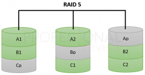

import { Tab, Tabs } from 'fumadocs-ui/components/tabs';
import { Step, Steps } from 'fumadocs-ui/components/steps';
import { Accordion, Accordions } from 'fumadocs-ui/components/accordion';

<Callout title="RAID Systems" type="info">
  RAID (Redundant Array of Inexpensive/Independent Disks) is a technology that combines multiple physical disk drives into one or more logical units for data redundancy, performance improvement, or both.
</Callout>

## 1. Introduction

  
Understanding RAID systems is crucial for server and storage management. In server environments, storage has historically presented several critical challenges:

  
  

    

      <h5 className="font-bold mb-2">Volume Management</h5>
      

        
Servers can accommodate dozens of hard drives, creating management challenges:

        
• Windows systems limited to 26 drive letters (A-Z)

        
• Each drive has unique capacity and characteristics

        
• Individual purpose assignment becomes impractical

      

    

    

      <h5 className="font-bold mb-2">Data Loss Risk</h5>
      

        
Drive failures in critical systems can be catastrophic:

        
• Database servers requiring 24/7 availability

        
• Recent data loss even with regular backups

        
• System downtime during backup restoration

      

    

    

      <h5 className="font-bold mb-2">Performance Bottlenecks</h5>
      

        
Early server storage systems faced limitations:

        
• Slow read/write operations

        
• Limited throughput affecting applications

        
• Need for improved I/O operations

      

    

  

  

    <h4 className="font-bold mb-2">RAID Solution</h4>
    

      
RAID technology emerged as a comprehensive solution to these challenges, implemented through:

      

        
• Hardware RAID controllers (built into motherboards or as expansion cards)

        
• Software RAID (managed by the operating system)

      

    

  

## 2. JBOD (Just a Bunch of Disks)

  
JBOD, while not technically a RAID level, represents the simplest approach to disk aggregation. It addresses the volume management issue by combining multiple physical disks into a single logical volume.

  

    
  

  

    

      <h4 className="font-bold mb-2">Key Features</h4>
      <ul className="list-disc pl-5">
        <li>Sequential disk combination</li>
        <li>Flexible disk size mixing</li>
        <li>Dynamic capacity expansion</li>
        <li>Simple implementation</li>
      </ul>
    

    
    

      <h4 className="font-bold mb-2">Business Value</h4>
      <ul className="list-disc pl-5">
        <li>Start with current needs</li>
        <li>Add capacity as needed</li>
        <li>Mix different disk technologies</li>
        <li>Cost-effective scaling</li>
      </ul>
    

  

  

    <h4 className="font-bold mb-2">Modern Applications</h4>
    
While JBOD was largely abandoned during the mass adoption of RAID, it has seen a resurgence in specific use cases:

    <ul className="list-disc pl-5">
      <li>Chia cryptocurrency farming</li>
      <li>Temporary data storage</li>
      <li>Media libraries with separate backup solutions</li>
      <li>Large media file storage where redundancy is not critical</li>
      <li>Development and testing environments</li>
    </ul>
  

## 3. RAID 0 (Striping)

  
RAID 0, while not one of the original RAID levels, was designed to address storage performance limitations rather than data security. It requires a minimum of two identical-capacity drives.

  

    
  

  

    <h4 className="font-bold mb-2">Operation Principles</h4>
    

      

        
Writing Process:

        <ul className="list-disc pl-5 mt-2">
          <li>Divides files into stripes</li>
          <li>Distributes stripes across all disks</li>
          <li>Writes occur simultaneously</li>
          <li>Each disk handles partial workload</li>
        </ul>
      

      
      

        
Reading Process:

        <ul className="list-disc pl-5 mt-2">
          <li>Multiple disks read simultaneously</li>
          <li>Controller reassembles data</li>
          <li>Theoretical read speed multiplied by disk count</li>
          <li>Actual performance depends on data distribution</li>
        </ul>
      

    

  

  

    

      <h4 className="font-bold mb-2">Advantages</h4>
      <ul className="list-disc pl-5">
        <li>Increased read/write speeds</li>
        <li>Full disk capacity utilization</li>
        <li>Simple implementation</li>
        <li>No capacity overhead</li>
        <li>Ideal for performance-critical applications</li>
      </ul>
    

    
    

      <h4 className="font-bold mb-2">Disadvantages</h4>
      <ul className="list-disc pl-5">
        <li>Zero data redundancy</li>
        <li>Single disk failure = complete data loss</li>
        <li>Risk increases with more disks</li>
        <li>Regular backups essential</li>
        <li>Not suitable for critical data</li>
      </ul>
    

  

## 4. RAID 1 (Mirroring)

  
RAID 1, one of the original RAID levels, was specifically designed to address data loss concerns through complete disk mirroring. It requires exactly two identical-capacity drives.

  

    
  

  

    <h4 className="font-bold mb-2">Operation Principles</h4>
    

      

        <h5 className="font-bold mb-2">Writing Process</h5>
        

          
• Data written simultaneously to both disks

          
• Each disk maintains complete copy

          
• Write speed limited by slowest disk

          
• Real-time data duplication

        

      

      
      

        <h5 className="font-bold mb-2">Reading Process</h5>
        

          
• Data readable from either disk

          
• Potential read performance improvement

          
• Load balancing between disks

          
• Continued operation if one disk fails

        

      

    

  

  

    <h4 className="font-bold mb-2">Backup Considerations</h4>
    

      

        <h5 className="font-bold mb-2">Protection Types</h5>
        

          
• Malicious attack prevention

          
• Accidental deletion recovery

          
• Simultaneous disk failure protection

          
• System-wide corruption safeguards

        

      

      
      

        <h5 className="font-bold mb-2">Best Practices</h5>
        

          
• Use drives from different batches

          
• Implement regular testing

          
• Monitor drive health

          
• Maintain offline backups

        

      

    

  

  

    

      <h4 className="font-bold mb-2">Advantages</h4>
      

        
• Complete data redundancy

        
• Improved read performance

        
• Simple failure recovery

        
• Real-time data protection

        
• No data loss on single failure

      

    

    
    

      <h4 className="font-bold mb-2">Disadvantages</h4>
      

        
• 50% capacity overhead

        
• No write performance gain

        
• Higher cost per usable GB

        
• Limited to two drives

        
• Double storage cost

      

    

  

## 5. Basic Nested RAID (0+1 and 1+0)

  
Nested RAID configurations combine the benefits of different RAID levels, typically aiming to achieve both performance and redundancy. The two most common basic nested configurations are RAID 0+1 and RAID 1+0 (also known as RAID 10).

  <Tabs items={["RAID 0+1", "RAID 1+0 (RAID 10)"]}>
    <Tab>
      

        <h4 className="font-bold mb-2">RAID 0+1 (Mirror of Stripes)</h4>
        
        

          
        

        
        
In RAID 0+1:

        <ul className="list-disc pl-5">
          <li><strong>First Level (Inner):</strong> RAID 0 striping on disk pairs</li>
          <li><strong>Second Level (Outer):</strong> RAID 1 mirroring of striped sets</li>
          <li>Minimum four drives required</li>
          <li>Data striped across primary disks</li>
          <li>Complete mirror maintained on secondary disks</li>
        </ul>
      

    </Tab>
    
    <Tab>
      

        <h4 className="font-bold mb-2">RAID 1+0 (Stripe of Mirrors)</h4>
        
        

          
        

        
        
In RAID 1+0:

        <ul className="list-disc pl-5">
          <li><strong>First Level (Inner):</strong> RAID 1 mirroring of disk pairs</li>
          <li><strong>Second Level (Outer):</strong> RAID 0 striping across mirrors</li>
          <li>Minimum four drives required</li>
          <li>Each disk has a dedicated mirror</li>
          <li>Data striped across mirrored pairs</li>
        </ul>
      

    </Tab>
  </Tabs>

  

    <h4 className="font-bold mb-2">Common Characteristics</h4>
    

      

        <h5 className="font-bold mb-2">Fault Tolerance</h5>
        

          
• Can survive single disk failure

          
• Multiple failure survival possible (33.3% chance)

          
• Automatic rebuild with spare disks

        

      

      
      

        <h5 className="font-bold mb-2">Performance</h5>
        

          
• Improved read and write speeds

          
• Better than single RAID 0 or RAID 1

          
• Load distribution across drives

        

      

      
      

        <h5 className="font-bold mb-2">Storage Efficiency</h5>
        

          
• 50% of total capacity available

          
• Higher cost per usable GB

          
• Minimum four drives required

        

      

    

  

## 6. RAID 4

  
RAID 4 attempts to achieve similar benefits to nested RAID configurations while using fewer disks, reducing capacity overhead. It requires a minimum of three drives.

  

    
  

  

    <h4 className="font-bold mb-2">Architecture</h4>
    

      

        <h5 className="font-bold mb-2">Data Disks</h5>
        

          
• Minimum two drives for data storage

          
• Data striped across disks (like RAID 0)

          
• Improved read/write performance

        

      

      
      

        <h5 className="font-bold mb-2">Parity Disk</h5>
        

          
• One dedicated disk for parity data

          
• Enables data recovery on failure

          
• Creates performance bottleneck

        

      

    

  

  

    <h4 className="font-bold mb-2">Parity Calculation</h4>
    
RAID 4 uses XOR operations for parity:

    
    <table className="w-full bg-gray-100 dark:bg-gray-900 rounded-lg overflow-hidden text-sm my-4">
      <thead className="bg-gray-200 dark:bg-gray-800">
        <tr>
          <th className="p-2 text-left">Sector</th>
          <th className="p-2 text-left">Disk1</th>
          <th className="p-2 text-left">Disk2</th>
          <th className="p-2 text-left">Parity</th>
        </tr>
      </thead>
      <tbody>
        <tr>
          <td className="p-2 border-t dark:border-gray-700">0</td>
          <td className="p-2 border-t dark:border-gray-700 font-mono">11110000</td>
          <td className="p-2 border-t dark:border-gray-700 font-mono">11111111</td>
          <td className="p-2 border-t dark:border-gray-700 font-mono">00001111</td>
        </tr>
        <tr>
          <td className="p-2 border-t dark:border-gray-700">1</td>
          <td className="p-2 border-t dark:border-gray-700 font-mono">11110000</td>
          <td className="p-2 border-t dark:border-gray-700 font-mono">00000000</td>
          <td className="p-2 border-t dark:border-gray-700 font-mono">11110000</td>
        </tr>
        <tr>
          <td className="p-2 border-t dark:border-gray-700">2</td>
          <td className="p-2 border-t dark:border-gray-700 font-mono">11110000</td>
          <td className="p-2 border-t dark:border-gray-700 font-mono">11110000</td>
          <td className="p-2 border-t dark:border-gray-700 font-mono">00000000</td>
        </tr>
      </tbody>
    </table>
    
    

      

        <h5 className="font-bold mb-2">XOR Properties</h5>
        

          
• Returns 0 when bits match

          
• Returns 1 when bits differ

          
• No numerical overflow risk

          
• Computationally efficient

        

      

      
      

        <h5 className="font-bold mb-2">Recovery Examples</h5>
        

          
• Disk1 fails: Disk2 ⊕ Parity = Original Disk1

          
• Disk2 fails: Disk1 ⊕ Parity = Original Disk2

          
• Parity fails: Disk1 ⊕ Disk2 = Original Parity

        

      

    

  

  

    

      <h4 className="font-bold mb-2">Advantages</h4>
      

        
• Single drive fault tolerance

        
• Improved read performance

        
• Lower capacity overhead

        
• Simple parity calculation

      

    

    
    

      <h4 className="font-bold mb-2">Disadvantages</h4>
      

        
• Parity disk bottleneck

        
• Write performance impact

        
• Limited scalability

        
• Rarely used in practice

      

    

  

## 7. RAID 5

  
RAID 5 is the practical evolution of RAID 4, eliminating the parity disk bottleneck while maintaining all its advantages. It's one of the most widely used RAID levels in enterprise environments.

  

    
  

  

    <h4 className="font-bold mb-2">Key Improvements</h4>
    

      

        <h5 className="font-bold mb-2">Distributed Parity</h5>
        

          
• Parity data spread across all disks

          
• Eliminates single disk bottleneck

          
• Better write performance than RAID 4

          
• More balanced disk utilization

        

      

      
      

        <h5 className="font-bold mb-2">Scalability</h5>
        

          
• Can use more than three disks

          
• One disk worth of capacity for parity

          
• Efficient capacity utilization at scale

        

      

    

  

  

    

      <h4 className="font-bold mb-2">Advantages</h4>
      

        
• Excellent read performance

        
• Distributed parity load

        
• Good capacity efficiency

        
• Single drive fault tolerance

        
• Industry standard solution

      

    

    
    

      <h4 className="font-bold mb-2">Disadvantages</h4>
      

        
• Write performance penalty

        
• Complex rebuild process

        
• Vulnerable during rebuilds

        
• Higher CPU usage

        
• One disk capacity overhead

      

    

  

## 8. Advanced Nested RAID

  
Beyond basic nested RAID configurations, enterprise environments sometimes implement more complex RAID nesting to meet specific performance and redundancy requirements.

  <Tabs items={["RAID 100", "RAID 50"]}>
    <Tab>
      

        <h4 className="font-bold mb-2">RAID 100 (Triple Nested)</h4>
        
        

          
        

        
        
Configuration levels:

        <ul className="list-disc pl-5">
          <li>First level: RAID 1 (Mirroring)</li>
          <li>Second level: RAID 0 (Striping)</li>
          <li>Third level: Additional RAID 0</li>
          <li>Minimum eight drives required</li>
          <li>50% capacity utilization</li>
          <li>Extreme performance potential</li>
        </ul>
      

    </Tab>
    
    <Tab>
      

        <h4 className="font-bold mb-2">RAID 50 (Double Nested)</h4>
        
        

          
        

        
        
Configuration levels:

        <ul className="list-disc pl-5">
          <li>First level: RAID 5 arrays</li>
          <li>Second level: RAID 0 striping</li>
          <li>Minimum six drives required</li>
          <li>Better performance than single RAID 5</li>
          <li>Multiple drive fault tolerance</li>
          <li>Complex management</li>
        </ul>
      

    </Tab>
  </Tabs>

## 9. Final Considerations

  

    

      

        <strong>1. RAID is Not Backup:</strong>
        <ul className="list-disc pl-8 mt-2">
          <li>Only provides hardware fault tolerance</li>
          <li>No protection against viruses or ransomware</li>
          <li>Cannot prevent accidental file deletion</li>
          <li>Separate backup strategy required</li>
        </ul>
      

      

        <strong>2. Modern Implementations:</strong>
        <ul className="list-disc pl-8 mt-2">
          <li>Automatic failure detection</li>
          <li>Hot-spare drive support</li>
          <li>Background rebuilding</li>
          <li>Minimal manual intervention</li>
        </ul>
      

      

        <strong>3. Data Recovery Complexity:</strong>
        <ul className="list-disc pl-8 mt-2">
          <li>RAID complicates recovery procedures</li>
          <li>Professional recovery often required</li>
          <li>Prevention better than recovery</li>
          <li>Regular testing recommended</li>
        </ul>
      

    

  

## Sources

  <ul className="list-disc pl-5">
    <li><a href="https://www.prepressure.com/library/technology/raid" target="_blank" rel="noopener noreferrer">PrePressure - RAID Technology Guide</a></li>
    <li><a href="https://www.intel.com/content/www/us/en/support/articles/000005867/memory-and-storage.html" target="_blank" rel="noopener noreferrer">Intel - RAID Technology Overview</a></li>
    <li><a href="https://www.seagate.com/support/kb/what-is-raid-and-what-are-the-different-types-188830en/" target="_blank" rel="noopener noreferrer">Seagate - RAID Types and Benefits</a></li>
    <li><a href="https://www.vmware.com/topics/glossary/content/raid-levels" target="_blank" rel="noopener noreferrer">VMware - RAID Levels Explained</a></li>
    <li><a href="https://www.ibm.com/docs/en/power8?topic=configuration-raid-arrays" target="_blank" rel="noopener noreferrer">IBM - RAID Arrays Configuration</a></li>
  </ul>

