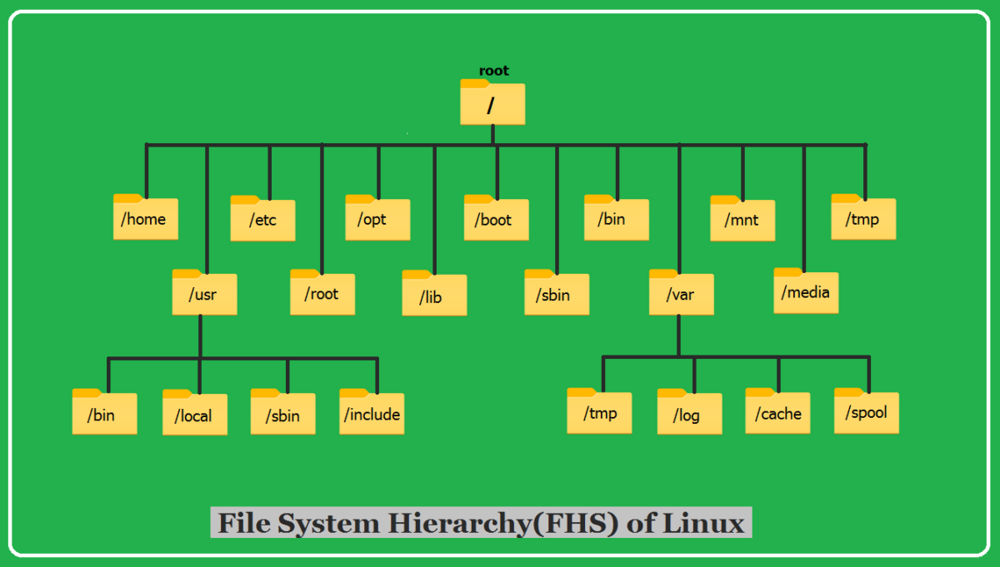

import { Tab, Tabs } from 'fumadocs-ui/components/tabs';

  <h1 className="text-3xl font-bold text-gray-800 dark:text-white mb-4">Linux Filesystem Hierarchy Standard (FHS)</h1>
  

    The Linux Filesystem Hierarchy Standard (FHS) defines the directory structure and directory contents in Unix-like operating systems. Maintained by the Linux Foundation, it provides a consistent and standardized approach to organizing system files across different Linux distributions.
  

  

    <h4 className="font-semibold text-blue-700 dark:text-blue-300 mb-2">Key Principles</h4>
    <ul className="list-disc list-inside text-gray-600 dark:text-gray-300 space-y-1">
      <li>All files and directories appear under the root directory (/), regardless of their physical storage location</li>
      <li>Directory existence may depend on installed subsystems (e.g., X Window System)</li>
      <li>While similar across Unix systems, these specifications are specifically for Linux systems</li>
      <li>Directory structure follows a hierarchical tree-like pattern</li>
    </ul>
  

## 1. File Types in Linux

<Tabs items={["General Files", "Directory Files", "Device Files"]}>
  <Tab>
    

      <h4 className="font-semibold text-emerald-700 dark:text-emerald-300 mb-2">General Files</h4>
      

        

          Regular files are the most common type in Linux systems, storing data in various formats.
        

        <ul className="list-disc list-inside text-gray-600 dark:text-gray-300">
          <li>Text files and documents</li>
          <li>Binary executables</li>
          <li>Image and media files</li>
          <li>Configuration files</li>
          <li>Data storage files</li>
        </ul>
        

          <h5 className="font-medium text-emerald-700 dark:text-emerald-300 mb-2">Key Characteristics</h5>
          <ul className="list-disc list-inside text-gray-600 dark:text-gray-300">
            <li>Can be edited and modified</li>
            <li>Support different formats</li>
            <li>Can be compressed</li>
            <li>Readable by applications</li>
          </ul>
        

      

    

  </Tab>
  <Tab>
    

      <h4 className="font-semibold text-amber-700 dark:text-amber-300 mb-2">Directory Files</h4>
      

        

          Directories are special files that contain references to other files and directories, creating the filesystem hierarchy.
        

        <ul className="list-disc list-inside text-gray-600 dark:text-gray-300">
          <li>Container for other files</li>
          <li>Hierarchical organization</li>
          <li>Special . and .. entries</li>
          <li>Path organization</li>
          <li>Access control points</li>
        </ul>
        

          <h5 className="font-medium text-amber-700 dark:text-amber-300 mb-2">Special Properties</h5>
          <ul className="list-disc list-inside text-gray-600 dark:text-gray-300">
            <li>Can have special permissions</li>
            <li>Support recursive operations</li>
            <li>Maintain file organization</li>
            <li>Enable path traversal</li>
          </ul>
        

      

    

  </Tab>
  <Tab>
    

      <h4 className="font-semibold text-violet-700 dark:text-violet-300 mb-2">Device Files</h4>
      

        

          Device files serve as interfaces to hardware devices and special system resources.
        

        <ul className="list-disc list-inside text-gray-600 dark:text-gray-300">
          <li>Block devices (storage)</li>
          <li>Character devices (terminals)</li>
          <li>Pseudo-devices</li>
          <li>System interfaces</li>
          <li>Hardware access points</li>
        </ul>
        

          <h5 className="font-medium text-violet-700 dark:text-violet-300 mb-2">Common Examples</h5>
          <ul className="list-disc list-inside text-gray-600 dark:text-gray-300">
            <li>/dev/sda (hard drives)</li>
            <li>/dev/tty (terminals)</li>
            <li>/dev/null (null device)</li>
            <li>/dev/random (random numbers)</li>
          </ul>
        

      

    

  </Tab>
</Tabs>

## 2. Root Directory (/)

  

    

      <h4 className="font-semibold text-slate-700 dark:text-slate-300 mb-2">Core Characteristics</h4>
      <ul className="list-disc list-inside text-gray-600 dark:text-gray-300">
        <li>Primary hierarchy root</li>
        <li>Base of filesystem tree</li>
        <li>Mount point for root filesystem</li>
        <li>Contains all other directories</li>
        <li>Write access restricted to root user</li>
      </ul>
    

    

      <h4 className="font-semibold text-slate-700 dark:text-slate-300 mb-2">Important Notes</h4>
      <ul className="list-disc list-inside text-gray-600 dark:text-gray-300">
        <li>Not to be confused with /root</li>
        <li>Critical for system operation</li>
        <li>Should be kept relatively small</li>
        <li>Contains essential directories</li>
        <li>Unified mount point hierarchy</li>
      </ul>
    

  

  

    <h4 className="font-semibold text-yellow-700 dark:text-yellow-300 mb-2">Security Considerations</h4>
    <ul className="list-disc list-inside text-gray-600 dark:text-gray-300">
      <li>Only root user can write under this directory</li>
      <li>Critical for system security</li>
      <li>Permissions carefully managed</li>
      <li>Core system integrity depends on root directory protection</li>
    </ul>
  

## 3. Essential System Directories

<Tabs items={["Core Binaries", "System Boot", "Configuration", "System Libraries"]}>
  <Tab>
    

      

        

          <h4 className="font-semibold text-green-700 dark:text-green-300 mb-2">/bin Directory</h4>
          

            Essential command binaries required for system operation and single-user mode.
          

          <ul className="list-disc list-inside text-gray-600 dark:text-gray-300">
            <li>Core system commands (ls, cp, mv)</li>
            <li>Shell interpreters (bash, sh)</li>
            <li>File manipulation tools</li>
            <li>Text processing commands</li>
            <li>Available to all users</li>
          </ul>
        

        

          <h4 className="font-semibold text-blue-700 dark:text-blue-300 mb-2">/sbin Directory</h4>
          

            System binaries essential for system administration and maintenance.
          

          <ul className="list-disc list-inside text-gray-600 dark:text-gray-300">
            <li>System maintenance tools</li>
            <li>Network configuration (ifconfig)</li>
            <li>Filesystem tools (fdisk, fsck)</li>
            <li>System control (init, route)</li>
            <li>Root-privileged commands</li>
          </ul>
        

      

    

  </Tab>
  <Tab>
    

      

        <h4 className="font-semibold text-yellow-700 dark:text-yellow-300 mb-2">/boot Directory</h4>
        

          

            <h5 className="font-medium text-gray-700 dark:text-gray-300 mb-2">Essential Components</h5>
            <ul className="list-disc list-inside text-gray-600 dark:text-gray-300">
              <li>Linux kernel (vmlinuz)</li>
              <li>Initial RAM disk (initrd)</li>
              <li>Boot loader files (GRUB)</li>
              <li>Boot configuration</li>
              <li>Kernel modules</li>
            </ul>
          

          

            <h5 className="font-medium text-gray-700 dark:text-gray-300 mb-2">Distribution Specifics</h5>
            <ul className="list-disc list-inside text-gray-600 dark:text-gray-300">
              <li>GRUB configuration location</li>
              <li>Kernel naming conventions</li>
              <li>Boot parameters</li>
              <li>Recovery options</li>
              <li>Version-specific files</li>
            </ul>
          

        

        

          <h5 className="font-medium text-orange-700 dark:text-orange-300 mb-2">Common Files</h5>
          <ul className="list-disc list-inside text-gray-600 dark:text-gray-300">
            <li>vmlinuz-[version] - Compressed Linux kernel</li>
            <li>initrd.img-[version] - Initial RAM disk</li>
            <li>grub/grub.cfg - GRUB2 configuration</li>
            <li>config-[version] - Kernel configuration</li>
            <li>System.map-[version] - Kernel symbol mapping</li>
          </ul>
        

      

    

  </Tab>
  <Tab>
    

      

        <h4 className="font-semibold text-red-700 dark:text-red-300 mb-2">/etc Directory</h4>
        

          

            <h5 className="font-medium text-gray-700 dark:text-gray-300 mb-2">Core Configuration</h5>
            <ul className="list-disc list-inside text-gray-600 dark:text-gray-300">
              <li>System-wide settings</li>
              <li>Network configuration</li>
              <li>User management files</li>
              <li>Service configurations</li>
              <li>Security policies</li>
            </ul>
          

          

            <h5 className="font-medium text-gray-700 dark:text-gray-300 mb-2">Key Files</h5>
            <ul className="list-disc list-inside text-gray-600 dark:text-gray-300">
              <li>passwd - User accounts</li>
              <li>shadow - Encrypted passwords</li>
              <li>fstab - Filesystem mounts</li>
              <li>hosts - Host name resolution</li>
              <li>resolv.conf - DNS settings</li>
            </ul>
          

        

        

          <h5 className="font-medium text-purple-700 dark:text-purple-300 mb-2">Distribution-Specific</h5>
          <ul className="list-disc list-inside text-gray-600 dark:text-gray-300">
            <li>Package management configuration</li>
            <li>Init system files (systemd/init.d)</li>
            <li>Default application settings</li>
            <li>System service parameters</li>
            <li>Distribution-specific tools</li>
          </ul>
        

      

    

  </Tab>
  <Tab>
    

      

        <h4 className="font-semibold text-indigo-700 dark:text-indigo-300 mb-2">/lib Directory</h4>
        

          

            <h5 className="font-medium text-gray-700 dark:text-gray-300 mb-2">Essential Libraries</h5>
            <ul className="list-disc list-inside text-gray-600 dark:text-gray-300">
              <li>Shared library files</li>
              <li>Kernel modules</li>
              <li>Device drivers</li>
              <li>System software libraries</li>
              <li>Boot loader files</li>
            </ul>
          

          

            <h5 className="font-medium text-gray-700 dark:text-gray-300 mb-2">Common Subdirectories</h5>
            <ul className="list-disc list-inside text-gray-600 dark:text-gray-300">
              <li>/lib/modules - Kernel modules</li>
              <li>/lib/firmware - Device firmware</li>
              <li>/lib/security - PAM modules</li>
              <li>/lib/systemd - Systemd units</li>
              <li>/lib/udev - Device rules</li>
            </ul>
          

        

      

    

  </Tab>
</Tabs>

## 4. User and Program Directories

<Tabs items={["/home Directory", "/usr Directory", "/opt Directory"]}>
  <Tab>
    

      

        <h4 className="font-semibold text-indigo-700 dark:text-indigo-300 mb-2">/home Directory</h4>
        

          

            Personal directories for regular users, containing their files and configurations.
          

          <ul className="list-disc list-inside text-gray-600 dark:text-gray-300">
            <li>User-specific files and directories</li>
            <li>Personal configuration files `(~/.config)`</li>
            <li>Application settings `(~/.local)`</li>
            <li>Cache files `(~/.cache)`</li>
            <li>Shell configuration `(~/.bashrc)`</li>
          </ul>
          

            <h5 className="font-medium text-blue-700 dark:text-blue-300 mb-2">Common Hidden Files</h5>
            <ul className="list-disc list-inside text-gray-600 dark:text-gray-300">
              <li>.profile - Login shell configuration</li>
              <li>.bashrc - Bash shell settings</li>
              <li>.ssh - SSH configuration and keys</li>
              <li>.local/share - User-specific data</li>
            </ul>
          

        

      

    

  </Tab>
  <Tab>
    

      

        <h4 className="font-semibold text-green-700 dark:text-green-300 mb-2">/usr Directory Structure</h4>
        

          

            Secondary hierarchy containing majority of user utilities and applications.
          

          

            

              <h5 className="font-medium text-gray-700 dark:text-gray-300 mb-2">Main Components</h5>
              <ul className="list-disc list-inside text-gray-600 dark:text-gray-300">
                <li>/usr/bin - User commands</li>
                <li>/usr/sbin - System admin commands</li>
                <li>/usr/lib - Program libraries</li>
                <li>/usr/share - Architecture-independent</li>
                <li>/usr/local - Local hierarchy</li>
              </ul>
            

            

              <h5 className="font-medium text-gray-700 dark:text-gray-300 mb-2">Additional Directories</h5>
              <ul className="list-disc list-inside text-gray-600 dark:text-gray-300">
                <li>/usr/include - Header files</li>
                <li>/usr/src - Source code</li>
                <li>/usr/doc - Documentation</li>
                <li>/usr/man - Manual pages</li>
                <li>/usr/games - Game files</li>
              </ul>
            

          

        

      

    

  </Tab>
  <Tab>
    

      

        <h4 className="font-semibold text-blue-700 dark:text-blue-300 mb-2">/opt Directory</h4>
        

          

            Optional application software packages and add-on products.
          

          

            

              <h5 className="font-medium text-gray-700 dark:text-gray-300 mb-2">Characteristics</h5>
              <ul className="list-disc list-inside text-gray-600 dark:text-gray-300">
                <li>Self-contained applications</li>
                <li>Third-party software</li>
                <li>Commercial applications</li>
                <li>Vendor-specific packages</li>
                <li>Optional system components</li>
              </ul>
            

            

              <h5 className="font-medium text-gray-700 dark:text-gray-300 mb-2">Organization</h5>
              <ul className="list-disc list-inside text-gray-600 dark:text-gray-300">
                <li>Each package in own directory</li>
                <li>Independent of system updates</li>
                <li>Vendor-maintained structure</li>
                <li>Easy package management</li>
              </ul>
            

          

        

      

    

  </Tab>
</Tabs>

## 5. System Operation Directories

<Tabs items={["/var Directory", "/proc Directory", "/sys Directory", "/run Directory"]}>
  <Tab>
    

      

        <h4 className="font-semibold text-violet-700 dark:text-violet-300 mb-2">/var Directory</h4>
        

          

            Contains variable data files that change during system operation.
          

          

            

              <h5 className="font-medium text-gray-700 dark:text-gray-300 mb-2">Key Directories</h5>
              <ul className="list-disc list-inside text-gray-600 dark:text-gray-300">
                <li>/var/log - System logs</li>
                <li>/var/mail - Mail spools</li>
                <li>/var/spool - Print/mail queues</li>
                <li>/var/cache - Application cache</li>
                <li>/var/tmp - Persistent temp files</li>
              </ul>
            

            

              <h5 className="font-medium text-gray-700 dark:text-gray-300 mb-2">Key Functions</h5>
              <ul className="list-disc list-inside text-gray-600 dark:text-gray-300">
                <li>System logging and monitoring</li>
                <li>Database files</li>
                <li>Web server data</li>
                <li>Package management files</li>
              </ul>
            

          

        

      

    

  </Tab>
  <Tab>
    

      

        <h4 className="font-semibold text-amber-700 dark:text-amber-300 mb-2">/proc Directory</h4>
        

          

            Virtual filesystem providing process and kernel information.
          

          

            

              <h5 className="font-medium text-gray-700 dark:text-gray-300 mb-2">System Information</h5>
              <ul className="list-disc list-inside text-gray-600 dark:text-gray-300">
                <li>/proc/[pid] - Process info</li>
                <li>/proc/cpuinfo - CPU details</li>
                <li>/proc/meminfo - Memory stats</li>
                <li>/proc/mounts - Mount points</li>
                <li>/proc/version - Kernel version</li>
              </ul>
            

            

              <h5 className="font-medium text-gray-700 dark:text-gray-300 mb-2">Key Features</h5>
              <ul className="list-disc list-inside text-gray-600 dark:text-gray-300">
                <li>Real-time process data</li>
                <li>System statistics</li>
                <li>Kernel parameters</li>
                <li>Hardware information</li>
              </ul>
            

          

        

      

    

  </Tab>
  <Tab>
    

      

        <h4 className="font-semibold text-emerald-700 dark:text-emerald-300 mb-2">/sys Directory</h4>
        

          

            Interface for kernel's view of the system hardware.
          

          

            

              <h5 className="font-medium text-gray-700 dark:text-gray-300 mb-2">Directory Structure</h5>
              <ul className="list-disc list-inside text-gray-600 dark:text-gray-300">
                <li>/sys/block - Block devices</li>
                <li>/sys/class - Device classes</li>
                <li>/sys/devices - All devices</li>
                <li>/sys/module - Kernel modules</li>
                <li>/sys/power - Power management</li>
              </ul>
            

            

              <h5 className="font-medium text-gray-700 dark:text-gray-300 mb-2">Key Features</h5>
              <ul className="list-disc list-inside text-gray-600 dark:text-gray-300">
                <li>Device management</li>
                <li>Driver information</li>
                <li>Hardware configuration</li>
                <li>System attributes</li>
              </ul>
            

          

        

      

    

  </Tab>
  <Tab>
    

      

        <h4 className="font-semibold text-slate-700 dark:text-slate-300 mb-2">/run Directory (Modern Systems)</h4>
        

          

            <h5 className="font-medium text-gray-700 dark:text-gray-300 mb-2">Purpose</h5>
            <ul className="list-disc list-inside text-gray-600 dark:text-gray-300">
              <li>Early-boot runtime data</li>
              <li>System service states</li>
              <li>Temporary runtime files</li>
              <li>PID files and sockets</li>
            </ul>
          

          

            <h5 className="font-medium text-gray-700 dark:text-gray-300 mb-2">Modern Replacements</h5>
            <ul className="list-disc list-inside text-gray-600 dark:text-gray-300">
              <li>/var/run → /run</li>
              <li>/var/lock → /run/lock</li>
              <li>/dev/shm → /run/shm</li>
              <li>/tmp → /run/tmp (some systems)</li>
            </ul>
          

        

      

    

  </Tab>
</Tabs>

## 6. Device and Media Directories

<Tabs items={["/dev Directory", "/media Directory", "/mnt Directory", "Device Management"]}>
  <Tab>
    

      

        <h4 className="font-semibold text-cyan-700 dark:text-cyan-300 mb-2">/dev Directory</h4>
        

          

            Essential device files representing hardware and virtual devices.
          

          

            

              <h5 className="font-medium text-gray-700 dark:text-gray-300 mb-2">Common Devices</h5>
              <ul className="list-disc list-inside text-gray-600 dark:text-gray-300">
                <li>/dev/sda - First SATA drive</li>
                <li>/dev/tty - Terminal devices</li>
                <li>/dev/null - Null device</li>
                <li>/dev/random - Random numbers</li>
                <li>/dev/usb - USB devices</li>
              </ul>
            

            

              <h5 className="font-medium text-gray-700 dark:text-gray-300 mb-2">Device Types</h5>
              <ul className="list-disc list-inside text-gray-600 dark:text-gray-300">
                <li>Block devices (storage)</li>
                <li>Character devices (serial)</li>
                <li>Pseudo-devices</li>
                <li>Virtual devices</li>
              </ul>
            

          

        

      

    

  </Tab>
  <Tab>
    

      

        <h4 className="font-semibold text-orange-700 dark:text-orange-300 mb-2">/media Directory</h4>
        

          

            Mount points for removable media, automatically managed by modern systems.
          

          

            

              <h5 className="font-medium text-gray-700 dark:text-gray-300 mb-2">Common Mount Points</h5>
              <ul className="list-disc list-inside text-gray-600 dark:text-gray-300">
                <li>/media/cdrom - CD/DVD drives</li>
                <li>/media/usb - USB storage</li>
                <li>/media/[user] - User mounts</li>
                <li>/media/[label] - Named devices</li>
              </ul>
            

            

              <h5 className="font-medium text-gray-700 dark:text-gray-300 mb-2">Modern Features</h5>
              <ul className="list-disc list-inside text-gray-600 dark:text-gray-300">
                <li>Automatic mounting</li>
                <li>User-specific mounts</li>
                <li>Device label support</li>
                <li>Dynamic management</li>
              </ul>
            

          

        

      

    

  </Tab>
  <Tab>
    

      

        <h4 className="font-semibold text-teal-700 dark:text-teal-300 mb-2">/mnt Directory</h4>
        

          

            Traditional mount point for temporary filesystems and manual mounts.
          

          

            

              <h5 className="font-medium text-gray-700 dark:text-gray-300 mb-2">Common Uses</h5>
              <ul className="list-disc list-inside text-gray-600 dark:text-gray-300">
                <li>Network filesystems</li>
                <li>Temporary mounts</li>
                <li>System partitions</li>
                <li>Manual mount points</li>
              </ul>
            

            

              <h5 className="font-medium text-gray-700 dark:text-gray-300 mb-2">Typical Contents</h5>
              <ul className="list-disc list-inside text-gray-600 dark:text-gray-300">
                <li>NFS shares</li>
                <li>SAMBA mounts</li>
                <li>Additional drives</li>
                <li>Recovery operations</li>
              </ul>
            

          

        

      

    

  </Tab>
  <Tab>
    

      

        <h4 className="font-semibold text-purple-700 dark:text-purple-300 mb-2">Device Management Evolution</h4>
        

          

            <h5 className="font-medium text-gray-700 dark:text-gray-300 mb-2">Modern Tools</h5>
            <ul className="list-disc list-inside text-gray-600 dark:text-gray-300">
              <li>udev - Dynamic device management</li>
              <li>systemd-mount - Automated mounting</li>
              <li>udisks2 - Storage management</li>
              <li>gvfs - Virtual filesystem</li>
            </ul>
          

          

            <h5 className="font-medium text-gray-700 dark:text-gray-300 mb-2">Distribution Differences</h5>
            <ul className="list-disc list-inside text-gray-600 dark:text-gray-300">
              <li>Automount configurations</li>
              <li>Mount point locations</li>
              <li>Device naming schemes</li>
              <li>Management tools</li>
            </ul>
          

        

      

    

  </Tab>
</Tabs>

## 7. Library and Support Directories

<Tabs items={["/lib Directory", "/srv Directory", "Temporary & Recovery"]}>
  <Tab>
    

      

        <h4 className="font-semibold text-rose-700 dark:text-rose-300 mb-2">/lib Directory</h4>
        

          

            Essential shared libraries and kernel modules required for system boot and binaries in /bin and /sbin.
          

          

            

              <h5 className="font-medium text-gray-700 dark:text-gray-300 mb-2">Core Components</h5>
              <ul className="list-disc list-inside text-gray-600 dark:text-gray-300">
                <li>ld* - Dynamic linker/loader</li>
                <li>lib*.so.* - Shared libraries</li>
                <li>/lib/modules - Kernel modules</li>
                <li>/lib/firmware - Device firmware</li>
                <li>/lib/security - PAM modules</li>
              </ul>
            

            

              <h5 className="font-medium text-gray-700 dark:text-gray-300 mb-2">Architecture Specifics</h5>
              <ul className="list-disc list-inside text-gray-600 dark:text-gray-300">
                <li>/lib64 - 64-bit libraries</li>
                <li>/lib32 - 32-bit libraries</li>
                <li>Platform-specific modules</li>
                <li>Hardware-specific drivers</li>
              </ul>
            

          

        

      

    

  </Tab>
  <Tab>
    

      

        <h4 className="font-semibold text-purple-700 dark:text-purple-300 mb-2">/srv Directory</h4>
        

          

            Site-specific data served by the system for various services.
          

          

            

              <h5 className="font-medium text-gray-700 dark:text-gray-300 mb-2">Common Services</h5>
              <ul className="list-disc list-inside text-gray-600 dark:text-gray-300">
                <li>/srv/www - Web server files</li>
                <li>/srv/ftp - FTP server files</li>
                <li>/srv/git - Git repositories</li>
                <li>/srv/mail - Mail server data</li>
                <li>/srv/nfs - NFS shares</li>
              </ul>
            

            

              <h5 className="font-medium text-gray-700 dark:text-gray-300 mb-2">Organization</h5>
              <ul className="list-disc list-inside text-gray-600 dark:text-gray-300">
                <li>Service-specific subdirectories</li>
                <li>Clear data separation</li>
                <li>Consistent access paths</li>
                <li>Easy service management</li>
              </ul>
            

          

        

      

    

  </Tab>
  <Tab>
    

      

        

          <h4 className="font-semibold text-yellow-700 dark:text-yellow-300 mb-2">/tmp Directory</h4>
          

            

              Temporary files directory cleared on system reboot.
            

            

              

                <h5 className="font-medium text-gray-700 dark:text-gray-300 mb-2">Characteristics</h5>
                <ul className="list-disc list-inside text-gray-600 dark:text-gray-300">
                  <li>World-writable directory</li>
                  <li>Automatic cleanup</li>
                  <li>Size restrictions possible</li>
                  <li>Memory-based on some systems</li>
                </ul>
              

              

                <h5 className="font-medium text-gray-700 dark:text-gray-300 mb-2">Common Uses</h5>
                <ul className="list-disc list-inside text-gray-600 dark:text-gray-300">
                  <li>Application temporary files</li>
                  <li>System process data</li>
                  <li>User temporary storage</li>
                  <li>Installation work files</li>
                </ul>
              

            

          

        

        

          <h4 className="font-semibold text-red-700 dark:text-red-300 mb-2">/lost+found Directory</h4>
          

            

              Recovery directory for damaged files after filesystem check.
            

            

              

                <h5 className="font-medium text-gray-700 dark:text-gray-300 mb-2">Purpose</h5>
                <ul className="list-disc list-inside text-gray-600 dark:text-gray-300">
                  <li>Filesystem recovery</li>
                  <li>Orphaned file storage</li>
                  <li>System crash recovery</li>
                  <li>Data preservation</li>
                </ul>
              

              

                <h5 className="font-medium text-gray-700 dark:text-gray-300 mb-2">Management</h5>
                <ul className="list-disc list-inside text-gray-600 dark:text-gray-300">
                  <li>fsck tool interaction</li>
                  <li>Automatic file recovery</li>
                  <li>Manual file inspection</li>
                  <li>Data restoration</li>
                </ul>
              

            

          

        

      

    

  </Tab>
</Tabs>

## Sources

  

    

      <h3 className="text-xl font-semibold mb-4 text-gray-800 dark:text-white">Official Documentation</h3>
      <ul>
        <li><a href="https://refspecs.linuxfoundation.org/FHS_3.0/fhs/index.html">Filesystem Hierarchy Standard</a></li>
        <li><a href="https://www.kernel.org/doc/Documentation/filesystems/">Linux Kernel Documentation</a></li>
        <li><a href="https://www.freedesktop.org/software/systemd/man/file-hierarchy.html">Systemd Documentation</a></li>
      </ul>
    

    

      <h3 className="text-xl font-semibold mb-4 text-gray-800 dark:text-white">Distribution-Specific Resources</h3>
      <ul>
        <li><a href="https://wiki.archlinux.org/title/File_hierarchy">Arch Linux Wiki - File Hierarchy</a></li>
        <li><a href="https://www.debian.org/doc/debian-policy/ch-opersys.html">Debian Policy Manual</a></li>
        <li><a href="https://access.redhat.com/documentation/en-us/red_hat_enterprise_linux/7/html/storage_administration_guide/ch-filesystem">Red Hat Documentation</a></li>
      </ul>
    

    

      <h3 className="text-xl font-semibold mb-4 text-gray-800 dark:text-white">Additional Resources</h3>
      <ul>
        <li><a href="https://tldp.org/LDP/Linux-Filesystem-Hierarchy/html/">Linux Documentation Project</a></li>
        <li><a href="https://www.pathname.com/fhs/">Pathname Guide</a></li>
        <li><a href="https://man7.org/linux/man-pages/man7/hier.7.html">Linux Man Pages</a></li>
      </ul>
    

    

      <h3 className="text-xl font-semibold mb-4 text-gray-800 dark:text-white">Community and Learning Resources</h3>
      <ul>
        <li><a href="https://linuxjourney.com/lesson/filesystem-hierarchy">Linux Journey</a></li>
        <li><a href="https://linuxhandbook.com/linux-directory-structure/">Linux Handbook</a></li>
        <li><a href="https://www.linux.com/training-tutorials/linux-filesystem-explained/">Linux.com</a></li>
      </ul>
    

  

