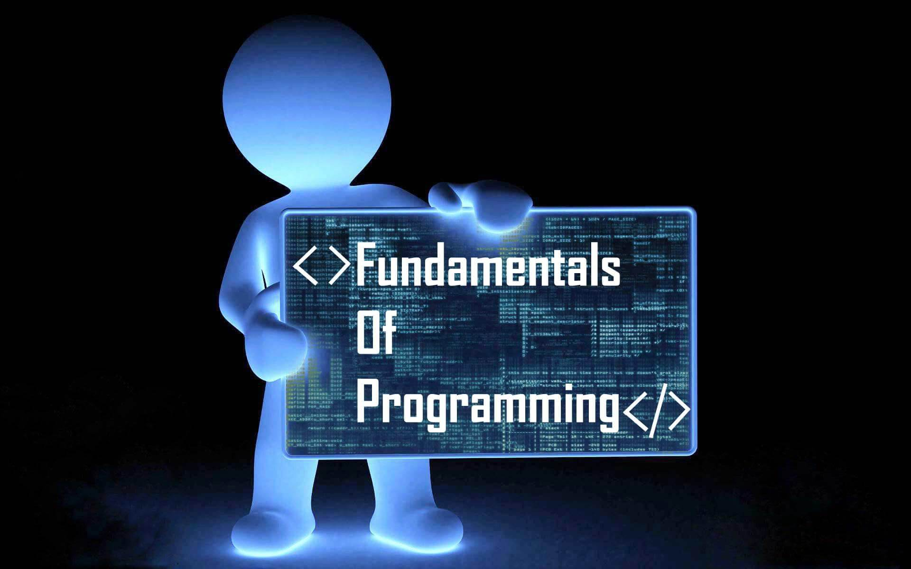

import { Tab, Tabs } from 'fumadocs-ui/components/tabs';
import { Step, Steps } from 'fumadocs-ui/components/steps';
import { Accordion, Accordions } from 'fumadocs-ui/components/accordion';



<Callout title="Welcome to Programming!" type="info">
  Programming is the art and science of instructing computers to perform tasks through carefully written instructions called code. This guide will introduce you to the fundamental concepts that form the foundation of all programming languages.
</Callout>

## 1. What is Programming?

<div className="p-4 border rounded-lg bg-gray-50 dark:bg-gray-900 my-4">
  <h3 className="font-bold mb-3">Understanding Programming</h3>
  <p className="mb-3">Programming is the process of creating a set of instructions (called code) that tell a computer how to perform a task. At its core, programming is about problem-solving - breaking down complex problems into smaller, manageable steps that a computer can understand and execute.</p>
  
  <h3 className="font-bold mb-3 mt-4">Key Components of Programming</h3>
  <ul className="list-disc pl-5 mb-4">
    <li><strong>Instructions</strong>: Clear, unambiguous commands that the computer can follow</li>
    <li><strong>Syntax</strong>: The specific rules and structure of writing code in a programming language</li>
    <li><strong>Logic</strong>: The reasoning and decision-making process behind solving problems</li>
    <li><strong>Data</strong>: Information that programs process and manipulate</li>
  </ul>

  <Accordions>
    <Accordion title="Why Learn Programming?">
      <div className="mb-4">
        <h4 className="font-bold mb-2">Career Benefits</h4>
        <ul className="list-disc pl-5">
          <li><strong>High Demand</strong>: Programming skills are sought after in virtually every industry</li>
          <li><strong>Career Flexibility</strong>: Work remotely, freelance, or join companies worldwide</li>
          <li><strong>Competitive Salary</strong>: Programmers typically earn above-average salaries</li>
          <li><strong>Career Growth</strong>: Constant learning and advancement opportunities</li>
        </ul>
      </div>
      
      <div>
        <h4 className="font-bold mb-2">Personal Development</h4>
        <ul className="list-disc pl-5">
          <li><strong>Problem Solving</strong>: Enhance analytical and logical thinking</li>
          <li><strong>Creativity</strong>: Express ideas through code</li>
          <li><strong>Independence</strong>: Build your own tools and solutions</li>
          <li><strong>Understanding Technology</strong>: Better grasp of the digital world</li>
        </ul>
      </div>
    </Accordion>
    
    <Accordion title="Real-World Applications">
      <div className="grid grid-cols-1 md:grid-cols-2 gap-4">
        <div>
          <h4 className="font-bold mb-2">Business Applications</h4>
          <ul className="list-disc pl-5">
            <li>Enterprise software systems</li>
            <li>E-commerce platforms</li>
            <li>Financial trading systems</li>
            <li>Business analytics tools</li>
          </ul>
        </div>
        
        <div>
          <h4 className="font-bold mb-2">Consumer Applications</h4>
          <ul className="list-disc pl-5">
            <li>Mobile apps</li>
            <li>Social media platforms</li>
            <li>Video games</li>
            <li>Smart home devices</li>
          </ul>
        </div>
      </div>
    </Accordion>
  </Accordions>
</div>

## 2. Core Programming Concepts

### Variables and Data Types

<Tabs items={["Theory", "Use Cases", "Examples"]}>
  <Tab>
    <div className="p-4 border rounded-lg bg-white dark:bg-gray-800 my-4">
      <h4 className="font-bold mb-2">What are Variables?</h4>
      <p className="mb-4">Variables are containers for storing data values. They are fundamental building blocks in programming that allow us to:</p>
      <ul className="list-disc pl-5 mb-4">
        <li>Store information for later use</li>
        <li>Manipulate data throughout the program</li>
        <li>Keep track of changing values</li>
        <li>Make code more readable and maintainable</li>
      </ul>
      <h4 className="font-bold mb-2">Common Data Types</h4>
      <ul className="list-disc pl-5">
        <li>
          <strong>Numbers</strong>
          <ul className="list-disc pl-5">
            <li>Integers: Whole numbers (1, -5, 1000)</li>
            <li>Floating-point: Decimal numbers (3.14, -0.001, 2.0)</li>
          </ul>
        </li>
        <li><strong>Strings</strong>: Text data ("Hello", "User123", "🎮")</li>
        <li><strong>Booleans</strong>: True/False values</li>
        <li><strong>Arrays/Lists</strong>: Collections of values [1, 2, 3]</li>
        <li><strong>Objects/Dictionaries</strong>: Key-value pairs {`{name: "John", age: 25}`}</li>
      </ul>
    </div>
  </Tab>
  <Tab>
    <div className="p-4 border rounded-lg bg-white dark:bg-gray-800 my-4">
      <h4 className="font-bold mb-2">Real-World Applications</h4>
      
      <div className="mb-4">
        <h5 className="font-semibold">User Information</h5>
        <ul className="list-disc pl-5">
          <li>Storing user profiles</li>
          <li>Tracking game scores</li>
          <li>Managing shopping cart items</li>
        </ul>
      </div>
      
      <div className="mb-4">
        <h5 className="font-semibold">Data Processing</h5>
        <ul className="list-disc pl-5">
          <li>Calculating averages</li>
          <li>Processing form inputs</li>
          <li>Storing API responses</li>
        </ul>
      </div>
      
      <div>
        <h5 className="font-semibold">Application State</h5>
        <ul className="list-disc pl-5">
          <li>User authentication status</li>
          <li>Application settings</li>
          <li>Cache storage</li>
        </ul>
      </div>
    </div>
  </Tab>
  <Tab>
    <div className="p-4 border rounded-lg bg-white dark:bg-gray-800 my-4">
      <h4 className="font-bold mb-2">Variable Declaration Examples</h4>
      
      <div className="mb-4">
        <h5 className="font-semibold">Python</h5>
```python
# Basic variables
name = "John"
age = 25
height = 1.75
is_student = True

# Data structures
numbers = [1, 2, 3, 4, 5]
user = {
    "name": "John",
    "age": 25,
    "email": "john@example.com"
}
```
      </div>

      <div className="mb-4">
        <h5 className="font-semibold">JavaScript</h5>
```javascript
// Basic variables
let name = "John";
const age = 25;
let height = 1.75;
let isStudent = true;

// Data structures
let numbers = [1, 2, 3, 4, 5];
let user = {
    name: "John",
    age: 25,
    email: "john@example.com"
};
```
      </div>
    </div>
  </Tab>
</Tabs>

### Control Structures

<Tabs items={["Theory", "Use Cases", "Examples"]}>
  <Tab>
    <div className="p-4 border rounded-lg bg-white dark:bg-gray-800 my-4">
      <h4 className="font-bold mb-2">What are Control Structures?</h4>
      <p className="mb-4">Control structures are programming constructs that determine the flow of execution in a program. They allow us to:</p>
      
      <ul className="list-disc pl-5 mb-4">
        <li>Make decisions based on conditions</li>
        <li>Repeat actions multiple times</li>
        <li>Group and organize code</li>
        <li>Handle different scenarios</li>
      </ul>

      <h4 className="font-bold mb-2">Types of Control Structures</h4>
      <ul className="list-disc pl-5">
        <li><strong>Conditional Statements</strong>: Make decisions (if, else, switch)</li>
        <li><strong>Loops</strong>: Repeat actions (for, while, do-while)</li>
        <li><strong>Exception Handling</strong>: Handle errors (try, catch)</li>
      </ul>
    </div>
  </Tab>
  <Tab>
    <div className="p-4 border rounded-lg bg-white dark:bg-gray-800 my-4">
      <h4 className="font-bold mb-2">Common Applications</h4>
      
      <div className="mb-4">
        <h5 className="font-semibold">Conditional Statements</h5>
        <ul className="list-disc pl-5">
          <li>User authentication</li>
          <li>Form validation</li>
          <li>Game logic</li>
          <li>Permission checking</li>
        </ul>
      </div>
      
      <div className="mb-4">
        <h5 className="font-semibold">Loops</h5>
        <ul className="list-disc pl-5">
          <li>Processing data lists</li>
          <li>Game animations</li>
          <li>Batch operations</li>
          <li>Data synchronization</li>
        </ul>
      </div>
    </div>
  </Tab>
  <Tab>
    <div className="p-4 border rounded-lg bg-white dark:bg-gray-800 my-4">
      <Accordions>
        <Accordion title="Conditional Examples">
```python
# Python
def check_age(age):
    if age >= 18:
        return "Adult"
    elif age >= 13:
        return "Teenager"
    else:
        return "Child"

# JavaScript
function checkAge(age) {
    if (age >= 18) {
        return "Adult";
    } else if (age >= 13) {
        return "Teenager";
    } else {
        return "Child";
    }
}
```
        </Accordion>
        
        <Accordion title="Loop Examples">
```python
# Python - Processing a list
numbers = [1, 2, 3, 4, 5]
sum = 0
for num in numbers:
    sum += num

# JavaScript - Processing an array
const numbers = [1, 2, 3, 4, 5];
let sum = 0;
for (let num of numbers) {
    sum += num;
}
```
        </Accordion>
      </Accordions>
    </div>
  </Tab>
</Tabs>

### Functions and Methods

<Tabs items={["Theory", "Use Cases", "Examples"]}>
  <Tab>
    <div className="p-4 border rounded-lg bg-white dark:bg-gray-800 my-4">
      <h4 className="font-bold mb-2">What are Functions?</h4>
      <p className="mb-4">Functions are reusable blocks of code that perform specific tasks. They are fundamental building blocks that help us:</p>
      
      <ul className="list-disc pl-5 mb-4">
        <li>Organize code into manageable pieces</li>
        <li>Avoid code repetition (DRY principle)</li>
        <li>Create modular and maintainable programs</li>
        <li>Share and reuse code across programs</li>
      </ul>

      <h4 className="font-bold mb-2">Function Components</h4>
      <ul className="list-disc pl-5">
        <li><strong>Parameters</strong>: Input values that functions receive</li>
        <li><strong>Return Values</strong>: Output that functions produce</li>
        <li><strong>Function Body</strong>: The actual code that performs the task</li>
        <li><strong>Scope</strong>: The context where function variables are valid</li>
      </ul>
    </div>
  </Tab>
  <Tab>
    <div className="p-4 border rounded-lg bg-white dark:bg-gray-800 my-4">
      <h4 className="font-bold mb-2">Common Applications</h4>
      
      <div className="mb-4">
        <h5 className="font-semibold">Data Processing</h5>
        <ul className="list-disc pl-5">
          <li>Calculating statistics</li>
          <li>Data transformation</li>
          <li>Input validation</li>
          <li>Data filtering</li>
        </ul>
      </div>
      
      <div className="mb-4">
        <h5 className="font-semibold">User Interface</h5>
        <ul className="list-disc pl-5">
          <li>Event handling</li>
          <li>Form processing</li>
          <li>Animation control</li>
          <li>State management</li>
        </ul>
      </div>
      
      <div>
        <h5 className="font-semibold">Utility Functions</h5>
        <ul className="list-disc pl-5">
          <li>Date formatting</li>
          <li>String manipulation</li>
          <li>Mathematical calculations</li>
          <li>Data conversion</li>
        </ul>
      </div>
    </div>
  </Tab>
  <Tab>
    <div className="p-4 border rounded-lg bg-white dark:bg-gray-800 my-4">
      <Accordions>
        <Accordion title="Basic Function Examples">
```python
# Python
def calculate_area(length, width):
    """Calculate the area of a rectangle"""
    return length * width

def greet(name, greeting="Hello"):
    """Greet a person with custom message"""
    return f"{greeting}, {name}!"

# JavaScript
function calculateArea(length, width) {
    return length * width;
}

const greet = (name, greeting = "Hello") => {
    return `${greeting}, ${name}!`;
};
```
        </Accordion>
        
        <Accordion title="Advanced Function Examples">
```python
# Python - Higher Order Function
def apply_operation(numbers, operation):
    return [operation(num) for num in numbers]

def double(x):
    return x * 2

numbers = [1, 2, 3, 4]
doubled = apply_operation(numbers, double)

# JavaScript - Callback Function
function processData(data, callback) {
    const result = data.map(callback);
    return result;
}

const numbers = [1, 2, 3, 4];
const doubled = processData(numbers, x => x * 2);
```
        </Accordion>
      </Accordions>
    </div>
  </Tab>
</Tabs>

### Object-Oriented Programming (OOP)

<Tabs items={["Theory", "Use Cases", "Examples"]}>
  <Tab>
    <div className="p-4 border rounded-lg bg-white dark:bg-gray-800 my-4">
      <h4 className="font-bold mb-2">What is OOP?</h4>
      <p className="mb-4">Object-Oriented Programming is a programming paradigm that organizes code into objects that contain both data and behavior. It is based on several key principles:</p>
      
      <ul className="list-disc pl-5 mb-4">
        <li><strong>Encapsulation</strong>: Bundling data and methods that operate on that data within a single unit</li>
        <li><strong>Inheritance</strong>: Creating new classes that are built upon existing classes</li>
        <li><strong>Polymorphism</strong>: Using a single interface to represent different types</li>
        <li><strong>Abstraction</strong>: Hiding complex implementation details and showing only functionality</li>
      </ul>

      <h4 className="font-bold mb-2">Key OOP Concepts</h4>
      <ul className="list-disc pl-5">
        <li><strong>Classes</strong>: Blueprints for creating objects</li>
        <li><strong>Objects</strong>: Instances of classes</li>
        <li><strong>Methods</strong>: Functions that belong to a class</li>
        <li><strong>Attributes</strong>: Data stored in an object</li>
      </ul>
    </div>
  </Tab>
  <Tab>
    <div className="p-4 border rounded-lg bg-white dark:bg-gray-800 my-4">
      <h4 className="font-bold mb-2">Real-World Applications</h4>
      
      <div className="mb-4">
        <h5 className="font-semibold">Software Systems</h5>
        <ul className="list-disc pl-5">
          <li>Game development (characters, items, environments)</li>
          <li>GUI applications (windows, buttons, forms)</li>
          <li>E-commerce systems (products, orders, users)</li>
          <li>Content management systems</li>
        </ul>
      </div>
      
      <div className="mb-4">
        <h5 className="font-semibold">Data Modeling</h5>
        <ul className="list-disc pl-5">
          <li>Database schemas</li>
          <li>API structures</li>
          <li>Business objects</li>
          <li>Domain models</li>
        </ul>
      </div>
    </div>
  </Tab>
  <Tab>
    <div className="p-4 border rounded-lg bg-white dark:bg-gray-800 my-4">
      <Accordions>
        <Accordion title="Basic Class Example">
```python
# Python
class BankAccount:
    def __init__(self, owner, balance=0):
        self.owner = owner
        self.balance = balance
    
    def deposit(self, amount):
        self.balance += amount
        return f"Deposited ${amount}. New balance: ${self.balance}"
    
    def withdraw(self, amount):
        if amount <= self.balance:
            self.balance -= amount
            return f"Withdrew ${amount}. New balance: ${self.balance}"
        return "Insufficient funds"

# Usage
account = BankAccount("John Doe", 1000)
print(account.deposit(500))  # Deposited $500. New balance: $1500
print(account.withdraw(200)) # Withdrew $200. New balance: $1300
```
        </Accordion>
        
        <Accordion title="Inheritance Example">
```python
# Python
class Animal:
    def __init__(self, name):
        self.name = name
    
    def speak(self):
        pass

class Dog(Animal):
    def speak(self):
        return f"{self.name} says Woof!"

class Cat(Animal):
    def speak(self):
        return f"{self.name} says Meow!"

# Usage
dog = Dog("Rex")
cat = Cat("Whiskers")
print(dog.speak())  # Rex says Woof!
print(cat.speak())  # Whiskers says Meow!
```
        </Accordion>
      </Accordions>
    </div>
  </Tab>
</Tabs>

### Input/Output and File Operations

<Tabs items={["Theory", "Use Cases", "Examples"]}>
  <Tab>
    <div className="p-4 border rounded-lg bg-white dark:bg-gray-800 my-4">
      <h4 className="font-bold mb-2">What is I/O?</h4>
      <p className="mb-4">Input/Output (I/O) refers to how a program interacts with the outside world, including users, files, and other systems. It encompasses:</p>
      
      <div className="mb-4">
        <h5 className="font-semibold">Standard I/O</h5>
        <ul className="list-disc pl-5">
          <li><strong>Input</strong>: Reading data from keyboard, command line, etc.</li>
          <li><strong>Output</strong>: Displaying data to console, terminal, etc.</li>
          <li><strong>Error Output</strong>: Displaying error messages and warnings</li>
        </ul>
      </div>

      <div className="mb-4">
        <h5 className="font-semibold">File Operations</h5>
        <ul className="list-disc pl-5">
          <li><strong>Reading</strong>: Getting data from files</li>
          <li><strong>Writing</strong>: Saving data to files</li>
          <li><strong>Appending</strong>: Adding data to existing files</li>
          <li><strong>File Management</strong>: Creating, deleting, moving files</li>
        </ul>
      </div>

      <div>
        <h5 className="font-semibold">File Types</h5>
        <ul className="list-disc pl-5">
          <li><strong>Text Files</strong>: Human-readable content (.txt, .csv, .json)</li>
          <li><strong>Binary Files</strong>: Machine-readable content (images, executables)</li>
          <li><strong>Structured Files</strong>: Data in specific formats (XML, JSON)</li>
        </ul>
      </div>
    </div>
  </Tab>
  <Tab>
    <div className="p-4 border rounded-lg bg-white dark:bg-gray-800 my-4">
      <h4 className="font-bold mb-2">Common Applications</h4>
      
      <div className="mb-4">
        <h5 className="font-semibold">Data Processing</h5>
        <ul className="list-disc pl-5">
          <li>Reading configuration files</li>
          <li>Processing CSV data</li>
          <li>Logging application events</li>
          <li>Saving application state</li>
        </ul>
      </div>
      
      <div className="mb-4">
        <h5 className="font-semibold">User Interaction</h5>
        <ul className="list-disc pl-5">
          <li>Command-line interfaces</li>
          <li>Form data collection</li>
          <li>User preferences storage</li>
          <li>Progress reporting</li>
        </ul>
      </div>
      
      <div>
        <h5 className="font-semibold">File Management</h5>
        <ul className="list-disc pl-5">
          <li>Data backup and recovery</li>
          <li>Document processing</li>
          <li>Media file handling</li>
          <li>Temporary file management</li>
        </ul>
      </div>
    </div>
  </Tab>
  <Tab>
    <div className="p-4 border rounded-lg bg-white dark:bg-gray-800 my-4">
      <Accordions>
        <Accordion title="Standard I/O Examples">
```python
# Python - Basic Input/Output
name = input("Enter your name: ")
age = int(input("Enter your age: "))
print(f"Hello, {name}! You are {age} years old.")

# JavaScript (Node.js) - Basic Input/Output
const readline = require('readline').createInterface({
    input: process.stdin,
    output: process.stdout
});

readline.question('Enter your name: ', name => {
    readline.question('Enter your age: ', age => {
        console.log(`Hello, ${name}! You are ${age} years old.`);
        readline.close();
    });
});
```
        </Accordion>
        
        <Accordion title="File Operations Examples">
```python
# Python - File Operations
# Writing to a file
with open('data.txt', 'w') as file:
    file.write('Hello, World!\n')
    file.write('This is a new line.')

# Reading from a file
with open('data.txt', 'r') as file:
    content = file.read()
    print(content)

# Appending to a file
with open('data.txt', 'a') as file:
    file.write('\nAppending new content')

# Reading CSV data
import csv

with open('data.csv', 'r') as file:
    csv_reader = csv.reader(file)
    for row in csv_reader:
        print(row)
```
        </Accordion>
        
        <Accordion title="JSON File Handling">
```python
# Python - JSON Operations
import json

# Writing JSON
data = {
    'name': 'John',
    'age': 30,
    'city': 'New York'
}

with open('data.json', 'w') as file:
    json.dump(data, file, indent=4)

# Reading JSON
with open('data.json', 'r') as file:
    loaded_data = json.load(file)
    print(loaded_data['name'])

# JavaScript - JSON Operations
const fs = require('fs');

// Writing JSON
const data = {
    name: 'John',
    age: 30,
    city: 'New York'
};

fs.writeFileSync('data.json', JSON.stringify(data, null, 4));

// Reading JSON
const loadedData = JSON.parse(fs.readFileSync('data.json'));
console.log(loadedData.name);
```
        </Accordion>
      </Accordions>
    </div>
  </Tab>
</Tabs>

## Sources

<div className="p-4 border rounded-lg bg-white dark:bg-gray-800 my-4">
  <ul className="list-disc pl-5">
    <li>[MDN Web Docs](https://developer.mozilla.org/)</li>
    <li>[Python Documentation](https://docs.python.org/)</li>
    <li>[JavaScript.info](https://javascript.info/)</li>
    <li>[Java Documentation](https://docs.oracle.com/javase/)</li>
    <li>[freeCodeCamp](https://www.freecodecamp.org/)</li>
    <li>[W3Schools](https://www.w3schools.com/)</li>
  </ul>
</div>