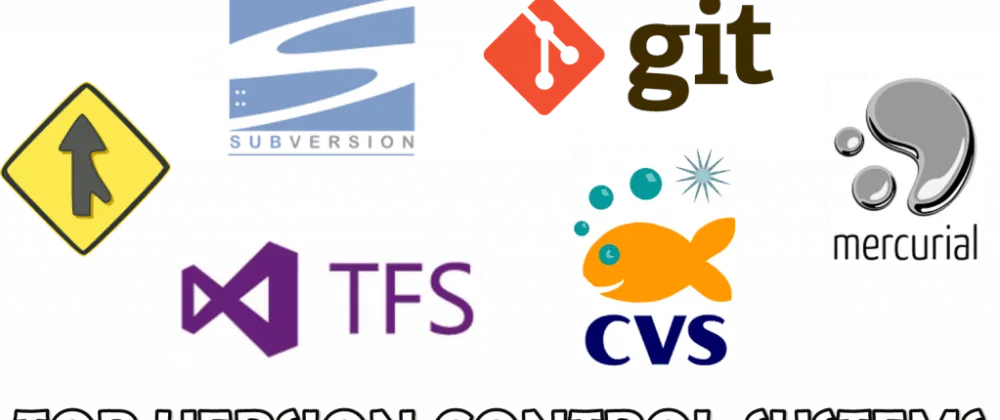

import { Tab, Tabs } from 'fumadocs-ui/components/tabs';
import { Step, Steps } from 'fumadocs-ui/components/steps';
import { Accordion, Accordions } from 'fumadocs-ui/components/accordion';

<Callout title="Version Control Systems" type="info">
  Version Control Systems (VCS) are essential tools in modern software development that track and manage changes to source code over time, enabling collaboration, history tracking, and code management across teams of any size.
</Callout>

## What is Version Control?

  
Version control, also known as source control or revision control, is a system that records changes to files over time, allowing you to recall specific versions later. It's an essential practice in software development that helps teams:

  
  <ul className="list-disc pl-5 mt-2">
    <li>Track every modification to the code</li>
    <li>Revert files or projects to previous states</li>
    <li>Compare changes over time</li>
    <li>Identify who made specific changes</li>
    <li>Collaborate effectively in team environments</li>
  </ul>

## Types of Version Control Systems

<Tabs items={["Local VCS", "Centralized VCS", "Distributed VCS"]}>
  <Tab>
    

      <h4 className="font-bold mb-2 text-blue-600 dark:text-blue-400">Local Version Control</h4>
      
The simplest form of version control, involving a local database that keeps track of file changes on your computer.

      
      

        <h5 className="font-bold">Key Features:</h5>
        <ul className="list-disc pl-5">
          <li>Simple database tracking changes</li>
          <li>Works on a single computer</li>
          <li>No collaboration features</li>
          <li>Example: RCS (Revision Control System)</li>
        </ul>
      

      
      

        <h5 className="font-bold">Limitations:</h5>
        <ul className="list-disc pl-5">
          <li>No remote backup</li>
          <li>Can't collaborate with others</li>
          <li>Single point of failure</li>
        </ul>
      

    

  </Tab>
  
  <Tab>
    

      <h4 className="font-bold mb-2 text-green-600 dark:text-green-400">Centralized Version Control</h4>
      
A system where a central server contains all versioned files, and clients check out files from that central place.

      
      

        <h5 className="font-bold">Key Features:</h5>
        <ul className="list-disc pl-5">
          <li>Central server stores all versions</li>
          <li>Clients check out latest snapshots</li>
          <li>Better collaboration than local VCS</li>
          <li>Examples: SVN, CVS</li>
        </ul>
      

      
      

        <h5 className="font-bold">Advantages:</h5>
        <ul className="list-disc pl-5">
          <li>Easy to understand</li>
          <li>Better administration control</li>
          <li>Simpler than distributed systems</li>
        </ul>
      

      
      

        <h5 className="font-bold">Limitations:</h5>
        <ul className="list-disc pl-5">
          <li>Single point of failure</li>
          <li>Server downtime = no work</li>
          <li>Limited offline capabilities</li>
        </ul>
      

    

  </Tab>
  
  <Tab>
    

      <h4 className="font-bold mb-2 text-purple-600 dark:text-purple-400">Distributed Version Control</h4>
      
Modern systems where clients fully mirror the repository, including its complete history.

      
      

        <h5 className="font-bold">Key Features:</h5>
        <ul className="list-disc pl-5">
          <li>Full repository mirroring</li>
          <li>No central server required</li>
          <li>Advanced branching and merging</li>
          <li>Examples: Git, Mercurial</li>
        </ul>
      

      
      

        <h5 className="font-bold">Advantages:</h5>
        <ul className="list-disc pl-5">
          <li>Better backup redundancy</li>
          <li>Offline work capability</li>
          <li>More flexible workflows</li>
          <li>Better performance</li>
        </ul>
      

    

  </Tab>
</Tabs>

## Key Benefits of Version Control

<Accordions>
  <Accordion title="1. History Tracking">
    <ul className="list-disc pl-5">
      <li>Complete long-term change history</li>
      <li>Ability to compare file versions</li>
      <li>Documentation of who changed what and when</li>
      <li>Understanding of how code evolved</li>
    </ul>
  </Accordion>
  
  <Accordion title="2. Collaboration Features">
    <ul className="list-disc pl-5">
      <li>Multiple developers can work simultaneously</li>
      <li>Conflict resolution tools</li>
      <li>Code review capabilities</li>
      <li>Branch management for features/fixes</li>
    </ul>
  </Accordion>
  
  <Accordion title="3. Backup and Recovery">
    <ul className="list-disc pl-5">
      <li>Automatic backup of all versions</li>
      <li>Ability to revert to previous states</li>
      <li>Protection against hardware failure</li>
      <li>Disaster recovery options</li>
    </ul>
  </Accordion>
  
  <Accordion title="4. Project Management">
    <ul className="list-disc pl-5">
      <li>Release management</li>
      <li>Issue tracking integration</li>
      <li>Development workflow organization</li>
      <li>Team productivity metrics</li>
    </ul>
  </Accordion>
</Accordions>

## Popular Version Control Systems

  

    <h4 className="font-bold text-blue-600 dark:text-blue-400">Git</h4>
    
The most widely used modern version control system in the world.

    <ul className="list-disc pl-5">
      <li>Created by Linus Torvalds</li>
      <li>Distributed architecture</li>
      <li>Excellent branching capabilities</li>
      <li>Large ecosystem (GitHub, GitLab, etc.)</li>
    </ul>
  

  
  

    <h4 className="font-bold text-green-600 dark:text-green-400">Mercurial</h4>
    
A distributed VCS known for its simplicity and performance.

    <ul className="list-disc pl-5">
      <li>Written in Python</li>
      <li>Easy to learn and use</li>
      <li>Excellent handling of binary files</li>
      <li>Strong merge capabilities</li>
    </ul>
  

  
  

    <h4 className="font-bold text-purple-600 dark:text-purple-400">Subversion (SVN)</h4>
    
A centralized VCS still widely used in enterprise environments.

    <ul className="list-disc pl-5">
      <li>Centralized architecture</li>
      <li>Simple learning curve</li>
      <li>Good handling of binary files</li>
      <li>Strong access control</li>
    </ul>
  

  
  

    <h4 className="font-bold text-red-600 dark:text-red-400">Perforce</h4>
    
Enterprise-focused VCS for large-scale development.

    <ul className="list-disc pl-5">
      <li>High performance</li>
      <li>Excellent for large binary files</li>
      <li>Strong security features</li>
      <li>Enterprise support</li>
    </ul>
  

## Best Practices

<Steps>
  <Step>
    <h4>Commit Best Practices</h4>
    <ul className="list-disc pl-5">
      <li>Write clear, descriptive commit messages</li>
      <li>Make atomic commits (one logical change per commit)</li>
      <li>Commit early and often</li>
      <li>Review changes before committing</li>
    </ul>
  </Step>
  
  <Step>
    <h4>Branching Strategy</h4>
    <ul className="list-disc pl-5">
      <li>Use feature branches for new development</li>
      <li>Maintain a stable main branch</li>
      <li>Delete merged branches</li>
      <li>Follow consistent naming conventions</li>
    </ul>
  </Step>
  
  <Step>
    <h4>Collaboration Guidelines</h4>
    <ul className="list-disc pl-5">
      <li>Pull/fetch before pushing</li>
      <li>Review code before merging</li>
      <li>Use meaningful branch names</li>
      <li>Document significant changes</li>
    </ul>
  </Step>
</Steps>

## Sources

  <ul className="list-disc pl-5">
    <li><a href="https://git-scm.com/book/en/v2" className="text-blue-600 hover:text-blue-800">Pro Git Book</a> by Scott Chacon and Ben Straub</li>
    <li><a href="https://www.atlassian.com/git" className="text-blue-600 hover:text-blue-800">Atlassian Git Tutorials</a></li>
    <li><a href="https://subversion.apache.org/" className="text-blue-600 hover:text-blue-800">Apache Subversion Documentation</a></li>
    <li><a href="https://www.mercurial-scm.org/" className="text-blue-600 hover:text-blue-800">Mercurial SCM</a></li>
    <li><a href="https://www.perforce.com/" className="text-blue-600 hover:text-blue-800">Perforce Documentation</a></li>
    <li><a href="https://docs.vscentrum.be/compute/software/version_control_systems.html" className="text-blue-600 hover:text-blue-800">VSC Documentation - Version Control Systems</a></li>
    <li><a href="https://medium.com/@mehran.hrajabi98/a-brief-history-of-version-control-systems-vcss-5881f07ba0e1" className="text-blue-600 hover:text-blue-800">A Brief History of Version Control Systems</a></li>
    <li><a href="https://www.atlassian.com/git/tutorials/what-is-version-control" className="text-blue-600 hover:text-blue-800">Atlassian - What is Version Control</a></li>
    <li><a href="https://www.spiceworks.com/tech/devops/articles/what-is-version-control/" className="text-blue-600 hover:text-blue-800">Spiceworks - What is Version Control</a></li>
    <li><a href="https://about.gitlab.com/topics/version-control/" className="text-blue-600 hover:text-blue-800">GitLab - Version Control Guide</a></li>
    <li><a href="https://en.wikipedia.org/wiki/List_of_version-control_software" className="text-blue-600 hover:text-blue-800">Wikipedia - List of Version Control Software</a></li>
  </ul>

