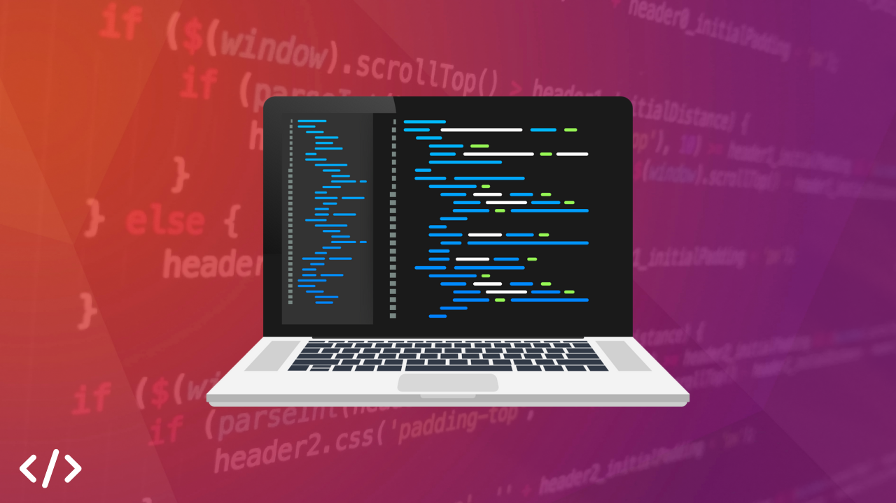

import { Tab, Tabs } from 'fumadocs-ui/components/tabs';
import { Step, Steps } from 'fumadocs-ui/components/steps';
import { Accordion, Accordions } from 'fumadocs-ui/components/accordion';

<Callout title="The Art and Science of Programming" type="info">
  Programming is the art of instructing computers to perform tasks through carefully crafted instructions called code. It's the foundation of all software applications, from mobile apps to complex scientific simulations.
</Callout>

## Introduction to Programming

  
Every digital interaction in our modern world is powered by code. When you check your email, browse social media, or use your smartphone, you're interacting with programs written by developers. Programming is not just about writing code—it's about solving problems, creating solutions, and bringing ideas to life through technology.

### What is Programming?

<Tabs items={["Core Concepts", "Programming Languages", "Development Process", "Career Paths"]}>
  <Tab>
    

      <h4 className="font-bold mb-2 text-blue-600 dark:text-blue-400">Essential Programming Concepts</h4>
      <ul className="list-disc pl-5">
        <li><strong>Variables & Data Types</strong>: Store and manipulate different kinds of information</li>
        <li><strong>Control Flow</strong>: Make decisions and repeat actions in code</li>
        <li><strong>Functions</strong>: Organize and reuse code efficiently</li>
        <li><strong>Objects & Classes</strong>: Model real-world entities in code</li>
        <li><strong>Algorithms</strong>: Solve problems through structured steps</li>
      </ul>
    

  </Tab>
  
  <Tab>
    

      <h4 className="font-bold mb-2 text-green-600 dark:text-green-400">Types of Programming Languages</h4>
      <Accordions>
        <Accordion title="General Purpose Languages">
          <ul className="list-disc pl-5">
            <li><strong>Python</strong>: Known for readability and versatility</li>
            <li><strong>JavaScript</strong>: Powers web interactivity</li>
            <li><strong>Java</strong>: Enterprise-grade applications</li>
            <li><strong>C++</strong>: System and performance-critical software</li>
          </ul>
        </Accordion>
        <Accordion title="Domain-Specific Languages">
          <ul className="list-disc pl-5">
            <li><strong>SQL</strong>: Database management</li>
            <li><strong>R</strong>: Statistical computing</li>
            <li><strong>MATLAB</strong>: Scientific computing</li>
            <li><strong>Solidity</strong>: Smart contracts</li>
          </ul>
        </Accordion>
      </Accordions>
    

  </Tab>
  
  <Tab>
    

      <h4 className="font-bold mb-2 text-purple-600 dark:text-purple-400">Software Development Lifecycle</h4>
      <Steps>
        <Step>
          <h5>Planning & Analysis</h5>
          
Define requirements and design solutions

        </Step>
        <Step>
          <h5>Development</h5>
          
Write and test code

        </Step>
        <Step>
          <h5>Testing & Debugging</h5>
          
Ensure quality and fix issues

        </Step>
        <Step>
          <h5>Deployment & Maintenance</h5>
          
Release and maintain software

        </Step>
      </Steps>
    

  </Tab>
  
  <Tab>
    

      <h4 className="font-bold mb-2 text-red-600 dark:text-red-400">Career Opportunities</h4>
      <ul className="list-disc pl-5">
        <li><strong>Web Development</strong>: Create websites and web applications</li>
        <li><strong>Mobile Development</strong>: Build apps for smartphones and tablets</li>
        <li><strong>Data Science</strong>: Analyze data and create insights</li>
        <li><strong>AI/ML Engineering</strong>: Develop intelligent systems</li>
        <li><strong>DevOps</strong>: Manage development and operations</li>
        <li><strong>Game Development</strong>: Create interactive entertainment</li>
      </ul>
    

  </Tab>
</Tabs>

## Applications of Programming

  

    <h4 className="font-bold mb-2">Technology & Software</h4>
    <ul className="list-disc pl-5">
      <li>Web Applications</li>
      <li>Mobile Apps</li>
      <li>Operating Systems</li>
      <li>Cloud Services</li>
      <li>Enterprise Software</li>
    </ul>
  

  
  

    <h4 className="font-bold mb-2">Science & Research</h4>
    <ul className="list-disc pl-5">
      <li>Data Analysis</li>
      <li>Scientific Simulations</li>
      <li>Bioinformatics</li>
      <li>Climate Modeling</li>
      <li>Research Tools</li>
    </ul>
  

  
  

    <h4 className="font-bold mb-2">Industry & Business</h4>
    <ul className="list-disc pl-5">
      <li>Automation Systems</li>
      <li>Financial Software</li>
      <li>Business Intelligence</li>
      <li>E-commerce Platforms</li>
      <li>CRM Systems</li>
    </ul>
  

  
  

    <h4 className="font-bold mb-2">Entertainment & Media</h4>
    <ul className="list-disc pl-5">
      <li>Video Games</li>
      <li>Streaming Platforms</li>
      <li>Digital Art Tools</li>
      <li>Social Media</li>
      <li>Content Management</li>
    </ul>
  

## Getting Started with Programming

<Steps>
  <Step>
    <h4>Choose Your Path</h4>
    
Select a programming domain that interests you: web development, mobile apps, data science, or others.

  </Step>
  <Step>
    <h4>Learn the Fundamentals</h4>
    
Master basic programming concepts like variables, functions, and control flow.

  </Step>
  <Step>
    <h4>Pick a Language</h4>
    
Start with a beginner-friendly language like Python or JavaScript.

  </Step>
  <Step>
    <h4>Build Projects</h4>
    
Apply your knowledge by creating real-world applications.

  </Step>
</Steps>

## Essential Skills for Programmers

<Accordions>
  <Accordion title="Technical Skills">
    <ul className="list-disc pl-5">
      <li><strong>Problem Solving</strong>: Break down complex problems into manageable parts</li>
      <li><strong>Logical Thinking</strong>: Develop structured solutions</li>
      <li><strong>Debugging</strong>: Find and fix code issues</li>
      <li><strong>Version Control</strong>: Manage code changes</li>
      <li><strong>Testing</strong>: Ensure code quality</li>
    </ul>
  </Accordion>
  
  <Accordion title="Soft Skills">
    <ul className="list-disc pl-5">
      <li><strong>Communication</strong>: Explain technical concepts clearly</li>
      <li><strong>Collaboration</strong>: Work effectively in teams</li>
      <li><strong>Continuous Learning</strong>: Stay updated with new technologies</li>
      <li><strong>Time Management</strong>: Handle multiple tasks and deadlines</li>
      <li><strong>Attention to Detail</strong>: Write precise and accurate code</li>
    </ul>
  </Accordion>
</Accordions>

## Sources

  <ul className="list-disc pl-5">
    <li><a href="https://www.freecodecamp.org/news/what-is-programming-tutorial-for-beginners/" target="_blank">freeCodeCamp - Free Coding Tutorials and Certification</a></li>
    <li><a href="https://survey.stackoverflow.co/2024/technology" target="_blank">Stack Overflow - Programming Language Trends</a></li>
    <li><a href="https://www.python.org/" target="_blank">Python Official Documentation</a></li>
    <li><a href="https://developer.mozilla.org/" target="_blank">MDN Web Docs - Web Development Resources</a></li>
  </ul>

