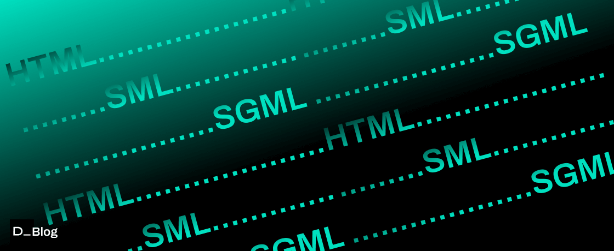

import { Tab, Tabs } from 'fumadocs-ui/components/tabs';
import { Step, Steps } from 'fumadocs-ui/components/steps';
import { Accordion, Accordions } from 'fumadocs-ui/components/accordion';

<Callout title="What is a Markup Language?" type="info">
  A markup language is a text-encoding system that defines the structure, formatting, and relationships between different parts of a document through special annotations called tags or markers.
</Callout>

## Understanding Markup Languages

  
Markup languages serve as the foundation for document formatting and web content presentation, using tags to define how elements should be displayed or interpreted.

  
  <Accordions>
    <Accordion title="Key Concepts">
      <ul className="list-disc pl-5">
        <li><strong>Tags</strong>: Special annotations that define how content should be structured or displayed</li>
        <li><strong>Elements</strong>: Combinations of opening tags, content, and closing tags</li>
        <li><strong>Attributes</strong>: Additional properties that can be added to tags to modify their behavior</li>
      </ul>
    </Accordion>
    
    <Accordion title="Common Features">
      <ul className="list-disc pl-5">
        <li>Text-based format that's human-readable</li>
        <li>Structured document representation</li>
        <li>Platform and software independence</li>
        <li>Support for metadata</li>
        <li>Clear separation of content and presentation</li>
      </ul>
    </Accordion>
  </Accordions>

## Types of Markup Languages

<Tabs items={["Presentational", "Procedural", "Descriptive"]}>
  <Tab>
    

      <h4 className="font-bold mb-2 text-blue-600 dark:text-blue-400">Presentational Markup</h4>
      
Focuses on the visual appearance of content, specifying how elements should be displayed.

      
      

        <h5 className="font-semibold">Examples:</h5>
        <ul className="list-disc pl-5 mt-2">
          <li>Traditional word processing formatting</li>
          <li>WYSIWYG editors</li>
          <li>Rich Text Format (RTF)</li>
        </ul>
      

    

  </Tab>
  <Tab>
    

      <h4 className="font-bold mb-2 text-green-600 dark:text-green-400">Procedural Markup</h4>
      
Provides instructions for programs to process and format text.

      
      

        <h5 className="font-semibold">Examples:</h5>
        <ul className="list-disc pl-5 mt-2">
          <li>TeX</li>
          <li>troff</li>
          <li>PostScript</li>
        </ul>
      

    

  </Tab>
  <Tab>
    

      <h4 className="font-bold mb-2 text-purple-600 dark:text-purple-400">Descriptive Markup</h4>
      
Labels parts of the document for what they are, rather than how they should be processed.

      
      

        <h5 className="font-semibold">Examples:</h5>
        <ul className="list-disc pl-5 mt-2">
          <li>XML</li>
          <li>HTML5</li>
          <li>SGML</li>
        </ul>
      

    

  </Tab>
</Tabs>

## Major Markup Languages

  

    <h3 className="text-xl font-bold mb-3 text-blue-600 dark:text-blue-400">HTML</h3>
    
HyperText Markup Language - The standard markup language for web pages.

    <ul className="list-disc pl-5">
      <li>Defines structure and presentation of web content</li>
      <li>Uses predefined tags</li>
      <li>Supported by all web browsers</li>
      <li>Can be enhanced with CSS and JavaScript</li>
    </ul>
  

  
  

    <h3 className="text-xl font-bold mb-3 text-green-600 dark:text-green-400">XML</h3>
    
eXtensible Markup Language - Designed for storing and transporting data.

    <ul className="list-disc pl-5">
      <li>Custom tags for flexible data structure</li>
      <li>Platform and language independent</li>
      <li>Supports data validation through schemas</li>
      <li>Widely used in web services and APIs</li>
    </ul>
  

  

    <h3 className="text-xl font-bold mb-3 text-purple-600 dark:text-purple-400">SGML</h3>
    
Standard Generalized Markup Language - The foundation for HTML and XML.

    <ul className="list-disc pl-5">
      <li>Meta-language for defining markup languages</li>
      <li>Highly flexible and customizable</li>
      <li>Complex but powerful</li>
      <li>Used in technical documentation</li>
    </ul>
  

  
  

    <h3 className="text-xl font-bold mb-3 text-red-600 dark:text-red-400">LaTeX</h3>
    
A document preparation system for high-quality typesetting.

    <ul className="list-disc pl-5">
      <li>Excellent for scientific documents</li>
      <li>Superior mathematical notation support</li>
      <li>Professional typography</li>
      <li>Document structure emphasis</li>
    </ul>
  

## Benefits of Markup Languages

<Accordions>
  <Accordion title="Improved Structure and Organization">
    <ul className="list-disc pl-5">
      <li>Clear document hierarchy</li>
      <li>Consistent formatting</li>
      <li>Easy content management</li>
      <li>Better maintainability</li>
    </ul>
  </Accordion>
  
  <Accordion title="Enhanced Accessibility">
    <ul className="list-disc pl-5">
      <li>Screen reader compatibility</li>
      <li>Semantic structure for better understanding</li>
      <li>Support for assistive technologies</li>
      <li>Improved user experience</li>
    </ul>
  </Accordion>
  
  <Accordion title="SEO Benefits">
    <ul className="list-disc pl-5">
      <li>Better search engine visibility</li>
      <li>Structured data support</li>
      <li>Improved content indexing</li>
      <li>Enhanced metadata capabilities</li>
    </ul>
  </Accordion>
</Accordions>

## Modern Applications

  <h3 className="text-xl font-bold mb-3">Beyond Traditional Uses</h3>
  
  

    

      <h4 className="font-bold text-blue-600 dark:text-blue-400">Web Development</h4>
      <ul className="list-disc pl-5 mt-2">
        <li>Static site generators</li>
        <li>JAMstack architecture</li>
        <li>Progressive web apps</li>
      </ul>
    

    
    

      <h4 className="font-bold text-green-600 dark:text-green-400">Data Exchange</h4>
      <ul className="list-disc pl-5 mt-2">
        <li>API responses</li>
        <li>Configuration files</li>
        <li>Data serialization</li>
      </ul>
    

    
    

      <h4 className="font-bold text-purple-600 dark:text-purple-400">Content Management</h4>
      <ul className="list-disc pl-5 mt-2">
        <li>Documentation systems</li>
        <li>Knowledge bases</li>
        <li>Digital publishing</li>
      </ul>
    

  

## Sources

  <ul className="space-y-2">
    <li><a href="https://www.w3.org/standards/xml/core" className="text-blue-600 hover:text-blue-800 dark:text-blue-400">W3C XML Technology</a></li>
    <li><a href="https://html.spec.whatwg.org/" className="text-blue-600 hover:text-blue-800 dark:text-blue-400">HTML Living Standard</a></li>
    <li><a href="https://www.latex-project.org/help/documentation/" className="text-blue-600 hover:text-blue-800 dark:text-blue-400">LaTeX Documentation</a></li>
    <li><a href="https://www.iso.org/standard/16387.html" className="text-blue-600 hover:text-blue-800 dark:text-blue-400">ISO SGML Standard</a></li>
    <li><a href="https://en.wikipedia.org/wiki/Markup_language" className="text-blue-600 hover:text-blue-800 dark:text-blue-400">Wikipedia - Markup Language</a></li>
    <li><a href="https://www.semrush.com/blog/markup-language/" className="text-blue-600 hover:text-blue-800 dark:text-blue-400">Semrush - Guide to Markup Languages</a></li>
    <li><a href="https://www.geeksforgeeks.org/explain-different-markup-languages-other-than-html/" className="text-blue-600 hover:text-blue-800 dark:text-blue-400">GeeksForGeeks - Different Markup Languages</a></li>
    <li><a href="https://corriol.github.io/mlims/01-mlxml/01_llenguatges/" className="text-blue-600 hover:text-blue-800 dark:text-blue-400">MLIMS - Markup Languages Guide</a></li>
    <li><a href="https://develocraft.com/blog-posts/what-is-a-markup-language" className="text-blue-600 hover:text-blue-800 dark:text-blue-400">Develocraft - What is a Markup Language</a></li>
  </ul>

